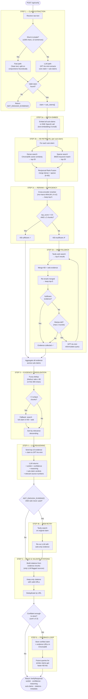

# Detailed Backend Flow

Flowchart of `agent.py → run_verification_pipeline()`. Each box is a single operation.

```mermaid
flowchart TD
    Start(["POST /api/verify"])
    Start --> S1_In

    subgraph Step1 ["STEP 1 — CLAIM EXTRACTION"]
        S1_In["Receive raw text"]
        S1_Check{"Short & simple?<br/>(≤300 chars, ≤3 sentences)"}
        S1_Fast["Fast path:<br/>Clean text, split on<br/>conjunctions heuristically"]
        S1_LLM["LLM path:<br/>GPT-4o-mini extracts<br/>core claim + sub-claims"]
        S1_NoClaim{"Valid claim<br/>found?"}
        S1_Exit(["Return NOT_ENOUGH_EVIDENCE"])
        S1_Out["claim + sub_claims[]"]

        S1_In --> S1_Check
        S1_Check -->|Yes| S1_Fast
        S1_Check -->|No| S1_LLM
        S1_Fast --> S1_NoClaim
        S1_LLM --> S1_NoClaim
        S1_NoClaim -->|No| S1_Exit
        S1_NoClaim -->|Yes| S1_Out
    end

    S1_Out --> S2a

    subgraph Step2a ["STEP 2a — BATCH EMBED"]
        S2a["Embed all sub-claims<br/>in ONE OpenAI call<br/>(text-embedding-3-small)"]
    end

    S2a --> S2b_Start

    subgraph Step2b ["STEP 2b — KB RETRIEVAL (per sub-claim)"]
        S2b_Start["For each sub-claim:"]
        S2b_Dense["Dense search<br/>ChromaDB cosine similarity<br/>→ top-20"]
        S2b_BM25["Sparse search<br/>BM25 keyword match<br/>→ top-20"]
        S2b_RRF["Reciprocal Rank Fusion<br/>merge dense + sparse<br/>(k=60)"]

        S2b_Start --> S2b_Dense
        S2b_Start --> S2b_BM25
        S2b_Dense --> S2b_RRF
        S2b_BM25 --> S2b_RRF
    end

    S2b_RRF --> S2c_Rerank

    subgraph Step2c ["STEP 2c — RERANK + SUFFICIENCY"]
        S2c_Rerank["Cross-encoder reranker<br/>(ms-marco-MiniLM-L-6-v2)<br/>→ keep top-5"]
        S2c_Check{"top_score > 0.5<br/>AND ≥ 2 chunks?"}
        S2c_OK["KB sufficient ✓"]
        S2c_Fail["KB insufficient ✗"]

        S2c_Rerank --> S2c_Check
        S2c_Check -->|Yes| S2c_OK
        S2c_Check -->|No| S2c_Fail
    end

    S2c_Fail --> S2d_Web

    subgraph Step2d ["STEP 2d — WEB FALLBACK"]
        S2d_Web["Tavily web search<br/>→ top-5 results"]
        S2d_Merge["Merge KB + web evidence"]
        S2d_Rerank2["Re-rerank merged<br/>→ keep top-5"]
        S2d_Check{"Sufficient<br/>evidence?"}
        S2d_Done["Evidence collected ✓"]
        S2d_Retry{"Retries left?<br/>(max 2 rounds)"}
        S2d_Reform["GPT-4o-mini<br/>reformulates query"]

        S2d_Web --> S2d_Merge --> S2d_Rerank2 --> S2d_Check
        S2d_Check -->|Yes| S2d_Done
        S2d_Check -->|No| S2d_Retry
        S2d_Retry -->|Yes| S2d_Reform --> S2d_Web
        S2d_Retry -->|No| S2d_Done
    end

    S2c_OK --> S2e
    S2d_Done --> S2e

    S2e["Aggregate all evidence<br/>across sub-claims"]

    S2e --> S3_Dedup

    subgraph Step3 ["STEP 3 — EVIDENCE CONSOLIDATION"]
        S3_Dedup["Fuzzy dedup<br/>(thefuzz ratio ≥ 80<br/>on first 300 chars)"]
        S3_Low{"< 3 unique<br/>chunks?"}
        S3_Fallback["Fallback: search<br/>full claim in KB + web"]
        S3_Sort["Sort by relevance<br/>descending"]

        S3_Dedup --> S3_Low
        S3_Low -->|Yes| S3_Fallback --> S3_Sort
        S3_Low -->|No| S3_Sort
    end

    S3_Sort --> S4_LLM

    subgraph Step4 ["STEP 4 — LLM REASONING"]
        S4_LLM["Send top-10 evidence<br/>+ claim to GPT-4o-mini"]
        S4_Out["LLM returns:<br/>• verdict + confidence<br/>• reasoning<br/>• sub-claim verdicts<br/>• relevant source numbers"]

        S4_LLM --> S4_Out
    end

    S4_Out --> S4b_Check

    S4b_Check{"NOT_ENOUGH_EVIDENCE<br/>AND web never used?"}

    subgraph Step4b ["STEP 4b — WEB RETRY"]
        S4b_Web["Tavily search<br/>on original claim"]
        S4b_LLM["Re-run LLM with<br/>web-only evidence"]

        S4b_Web --> S4b_LLM
    end

    S4b_Check -->|Yes| S4b_Web
    S4b_Check -->|No| S5_Build
    S4b_LLM --> S5_Build

    subgraph Step5 ["STEP 5 — BUILD & VALIDATE CITATIONS"]
        S5_Build["Build citations from<br/>evidence chunks<br/>(only LLM-flagged sources)"]
        S5_Filter["Keep only citations<br/>with valid URLs"]
        S5_Dedup["Deduplicate by URL"]

        S5_Build --> S5_Filter --> S5_Dedup
    end

    S5_Dedup --> S6_Check

    S6_Check{"Confident enough<br/>to store?<br/>(conf ≥ 0.3)"}

    subgraph Step6 ["STEP 6 — FEEDBACK LOOP"]
        S6_Store["Store verified claim<br/>+ evidence URLs in<br/>ChromaDB"]
        S6_Benefit["Future queries for<br/>similar claims get<br/>faster KB hits"]

        S6_Store --> S6_Benefit
    end

    S6_Check -->|Yes| S6_Store
    S6_Check -->|No| Final

    S6_Benefit --> Final

    Final(["Return VerifyResponse<br/>verdict · confidence · reasoning<br/>sub-claims · citations · metadata"])
```
