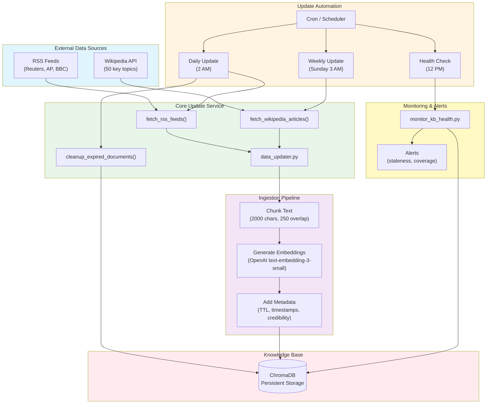
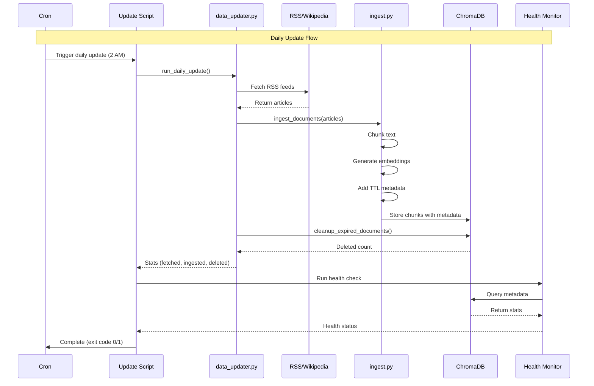
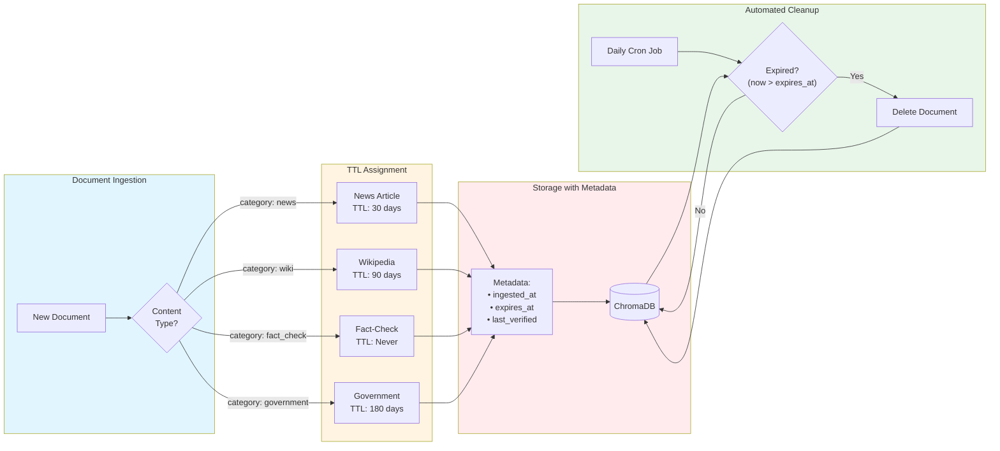
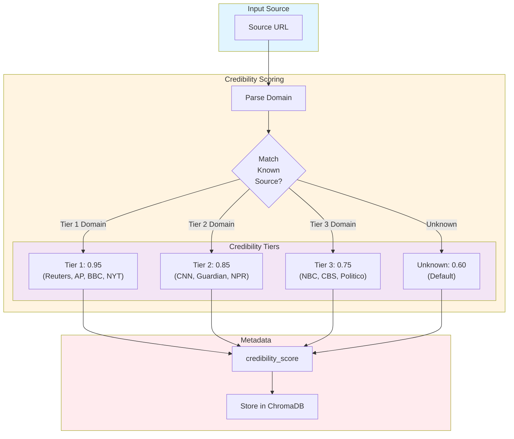
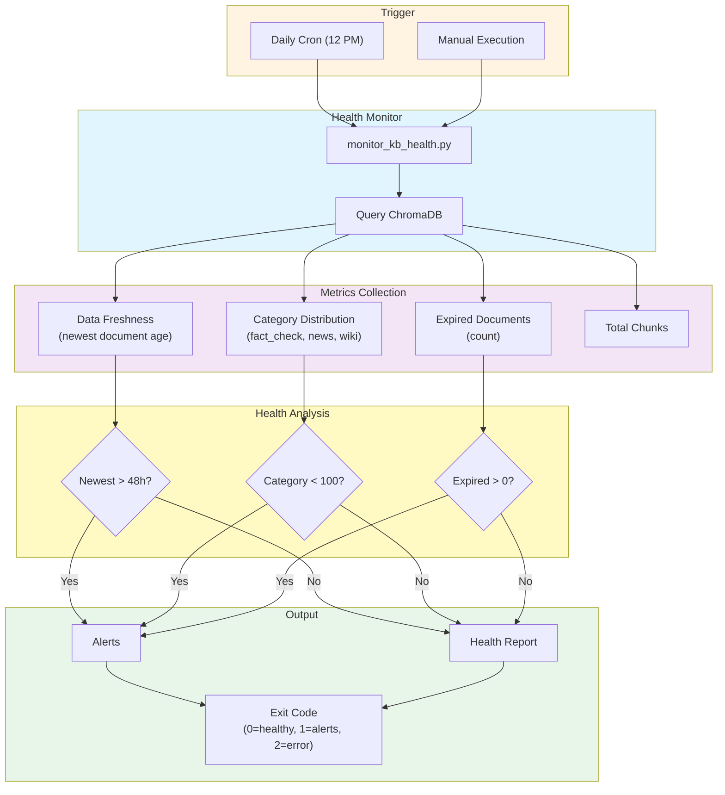
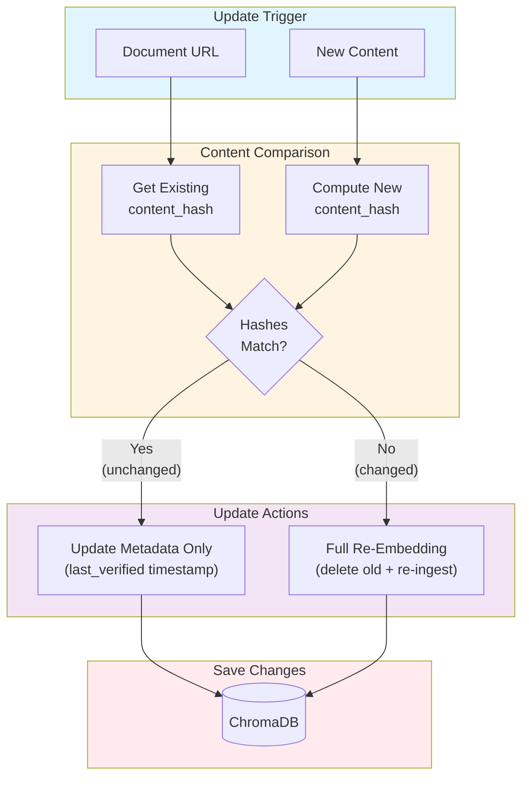
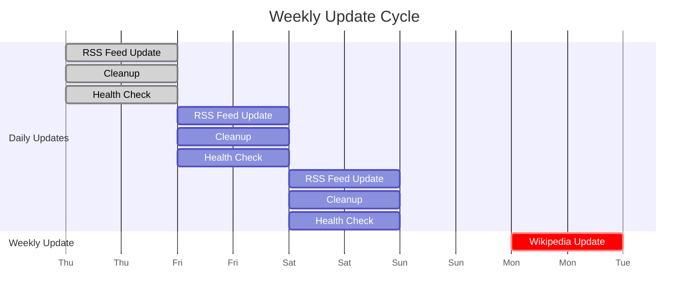

# Phase 2 Architecture - Data Update System

## High-Level Overview



## Data Flow Diagram



## TTL Management System



## Source Credibility Scoring



## Health Monitoring System



## Smart Update Logic (Differential Re-Embedding)



## Complete Update Cycle



## File Architecture

```
week1/
│
├── backend/app/
│   ├── config.py                      # Phase 2 settings
│   ├── services/
│   │   └── data_updater.py           # Core update logic
│   └── knowledge_base/
│       └── ingest.py                  # Enhanced with TTL
│
├── scripts/
│   ├── update_kb_daily.py            # Daily orchestrator
│   ├── update_kb_weekly.py           # Weekly orchestrator
│   ├── monitor_kb_health.py          # Health monitoring
│   ├── run_scheduler.py              # Built-in scheduler
│   └── test_update_system.py         # Test suite
│
├── logs/                              # Auto-generated logs
│   ├── daily_update.log
│   ├── weekly_update.log
│   └── health_check.log
│
├── data/chroma_db/                    # Knowledge base storage
│
├── crontab.example                    # Cron configuration
├── DATA_UPDATE_GUIDE.md              # Full documentation
└── PHASE2_QUICKREF.md                # Quick reference
```

## Technology Stack

| Component | Technology | Purpose |
|-----------|-----------|---------|
| **Update Service** | Python async | Core update logic |
| **RSS Parsing** | feedparser | Parse RSS feeds |
| **Wikipedia API** | wikipedia-api | Fetch Wikipedia articles |
| **Scheduling** | cron / schedule | Automate updates |
| **Storage** | ChromaDB | Vector database |
| **Embeddings** | OpenAI API | Generate embeddings |
| **Monitoring** | Python logging | Health checks & alerts |

## Key Design Decisions

### 1. TTL-Based Expiration
**Decision:** Use content-type-based TTL rather than uniform expiration

**Rationale:**
- Fact-checks are historical records (never expire)
- News becomes context after 30 days
- Wikipedia needs periodic refresh (90 days)
- Prevents unbounded storage growth

### 2. Hybrid Automation
**Decision:** Support both cron and built-in scheduler

**Rationale:**
- Cron for production (Linux/macOS)
- Built-in scheduler for development/Windows
- Flexibility for different deployment scenarios

### 3. Tiered Credibility
**Decision:** Pre-defined credibility tiers for sources

**Rationale:**
- Transparent source quality scoring
- Easy to audit and update
- Used in verification reasoning

### 4. Smart Re-Embedding
**Decision:** Hash-based change detection before re-embedding

**Rationale:**
- Saves API costs (embeddings)
- Reduces processing time
- Metadata-only updates for unchanged content

### 5. Health Monitoring
**Decision:** Separate health check script with alerts

**Rationale:**
- Proactive issue detection
- Independent of update process
- Actionable alerts (staleness, coverage)

## Performance Characteristics

### Update Frequency
- **Daily:** RSS feeds (50 articles) + cleanup
- **Weekly:** Wikipedia (50 articles)
- **Health:** Daily check

### Processing Times
- RSS update: 2-5 minutes
- Wikipedia update: 5-10 minutes
- Cleanup: < 1 minute
- Health check: < 30 seconds

### API Costs
- Daily RSS: $0.001 (embeddings)
- Weekly Wikipedia: $0.010 (embeddings)
- **Monthly total: ~$0.07**

### Storage Impact
- Daily growth: ~5MB (with cleanup)
- Weekly growth: ~20MB
- Stable state: 1-2GB (with TTL)

## Security Considerations

1. **API Keys:** Stored in `.env`, never in code
2. **Source Validation:** URL parsing and credibility scoring
3. **Rate Limiting:** Built-in delays for external APIs
4. **Input Sanitization:** Safe handling of fetched content
5. **Log Security:** Logs don't contain sensitive data

## Monitoring & Observability

### Logs
- Structured logging with timestamps
- Separate log files per component
- Rotation after 30 days

### Metrics Tracked
- Documents fetched/ingested
- Expired documents deleted
- Data staleness
- Category distribution
- Source coverage

### Alerts Triggered
- Data staleness > 48 hours
- Category coverage < 100 chunks
- Expired documents detected
- Update failures

## Scalability Path

### Current (Phase 2)
- Single-machine deployment
- Scheduled updates
- Local ChromaDB

### Future (Phase 3)
- Distributed updates (Celery workers)
- Event-driven updates (webhooks)
- Centralized monitoring (Prometheus)
- Cloud storage (managed vector DB)

---

**Architecture Version:** 1.0
**Last Updated:** 2026-02-12
**Status:** ✅ Implemented and Tested
