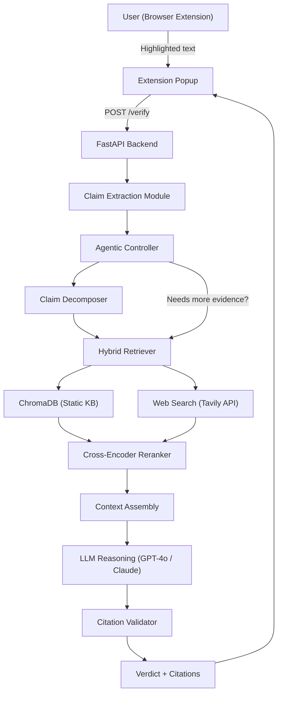
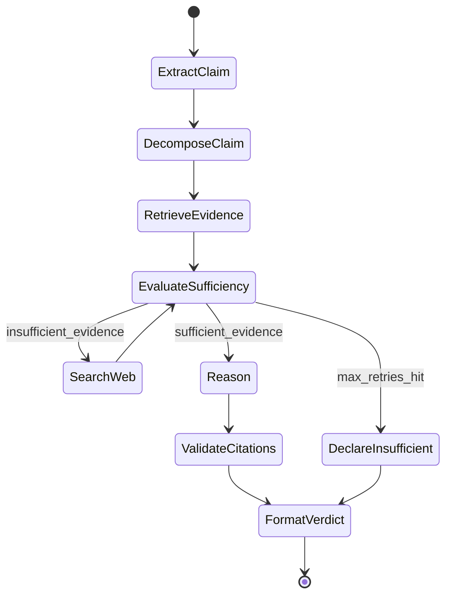
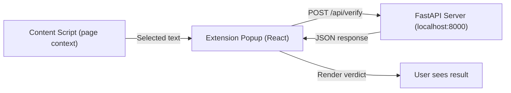

# Real-Time News Claim Verification System -- Implementation Plan

---

## 1. System Architecture

### High-Level Data Flow




### Core Components


| Component              | Technology                                 | Justification                                               |
| ---------------------- | ------------------------------------------ | ----------------------------------------------------------- |
| **UI Layer**           | Chrome Extension (Manifest V3)             | Preferred per spec; highlight-and-verify UX                 |
| **Backend**            | FastAPI (Python 3.11+)                     | Async, fast, easy to build in hackathon timeframe           |
| **Claim Extraction**   | LLM prompt (GPT-4o-mini)                   | Cheap, fast extraction of core claim from raw text          |
| **Embedding**          | `text-embedding-3-small` (OpenAI)          | 1536-dim, cheap ($0.02/1M tokens), strong retrieval quality |
| **Vector DB**          | ChromaDB (local, persistent)               | Zero-infra, pip install, perfect for hackathon              |
| **Web Search**         | Tavily Search API                          | Built for RAG; returns clean text, not just URLs            |
| **Reranker**           | `cross-encoder/ms-marco-MiniLM-L-6-v2`     | Fast, accurate, runs locally on CPU                         |
| **LLM**                | GPT-4o (primary) / Claude 3.5 Sonnet (alt) | Best reasoning, structured output support                   |
| **Agentic Controller** | Custom Python loop (no framework overhead) | Simple state machine; LangGraph optional upgrade            |


---

## 2. RAG Pipeline Design

### Embedding Model

- **Choice**: OpenAI `text-embedding-3-small`
- **Why**: 1536 dimensions, excellent retrieval quality, fast API, cheap. For a hackathon, managed API avoids GPU infra.
- **Alternative**: `sentence-transformers/all-MiniLM-L6-v2` (free, local, 384-dim) if cost is a concern.

### Vector Database

- **Choice**: ChromaDB with persistent storage
- **Why**: `pip install chromadb`, no Docker/server needed, supports metadata filtering, good enough for 100K+ documents.
- **Alternative**: FAISS (faster at scale but no metadata filtering natively).

### Chunking Strategy

- **Chunk size**: 512 tokens (approx 2000 chars)
- **Overlap**: 64 tokens (~250 chars)
- **Method**: Recursive text splitting (by paragraph -> sentence -> character)
- **Metadata per chunk**:

```python
{
    "source_url": str,
    "source_name": str,          # e.g., "Wikipedia", "PolitiFact"
    "publish_date": str,         # ISO format
    "category": str,             # "fact_check", "news", "wiki", "government"
    "credibility_score": float,  # 0.0 - 1.0
    "chunk_index": int,
    "document_id": str
}
```

### Indexing Strategy

- Single ChromaDB collection: `knowledge_base`
- Metadata filters on `category` and `publish_date` for scoped retrieval
- Pre-compute embeddings in batch during KB ingestion

### Retrieval Strategy

- **Hybrid search**: ChromaDB dense vector search + BM25 (via `rank_bm25` Python lib) on raw text
- **Top-K**: Retrieve top-20 from each method, merge via Reciprocal Rank Fusion (RRF)
- **Filtering**: Date recency filter for time-sensitive claims
- **Implementation**:

```python
# Pseudo-code for hybrid retrieval
dense_results = chroma_collection.query(query_embedding, n_results=20)
bm25_results = bm25_index.get_top_n(query_tokens, documents, n=20)
merged = reciprocal_rank_fusion(dense_results, bm25_results, k=60)
top_candidates = merged[:15]
```

### Reranking

- **Model**: `cross-encoder/ms-marco-MiniLM-L-6-v2` (via `sentence-transformers`)
- **Why**: ~50ms per 15 candidates on CPU. Good accuracy/speed tradeoff.
- **Process**: Score each (query, passage) pair, re-sort, take top-5

### Context Assembly

- Top-5 reranked passages assembled into a structured prompt:
  - Each passage wrapped with `[Source N]: {text} (from: {source_name}, date: {date}, url: {url})`
  - Passed as `context` to the LLM reasoning prompt

---

## 3. Knowledge Base Design

### A) Static Knowledge (Pre-indexed)

Build an ingestion script (`scripts/ingest_kb.py`) that processes:

1. **Fact-check datasets** (priority -- most useful for hackathon demo):
  - LIAR dataset (12.8K labeled statements) -- download from [LIAR dataset](https://www.cs.ucsb.edu/~william/data/liar_dataset.zip)
  - PolitiFact / Snopes scraped summaries (if time permits)
  - Google Fact Check Tools API (free, returns ClaimReview markup)
2. **Wikipedia** (selective):
  - Download key topic articles via Wikipedia API (not full dump)
  - Focus: politics, health, science, economics -- common misinformation domains
  - ~5000-10000 articles is sufficient for demo
3. **News archives** (optional, time permitting):
  - RSS feeds from AP News, Reuters, BBC (public feeds)

### B) Live Web Validation

- **Primary**: Tavily Search API
  - Designed for RAG: returns clean extracted text, not just links
  - Free tier: 1000 searches/month (enough for hackathon)
  - Endpoint: `tavily.search(query, search_depth="advanced", max_results=5)`
- **Fallback**: Google Custom Search API (100 free queries/day) or SerpAPI
- **Rate limiting**: Simple in-memory rate limiter (token bucket), 10 req/min
- **Caching**: `functools.lru_cache` or Redis-like dict cache keyed on normalized query. TTL = 1 hour for web results.
- **Source credibility scoring**:

```python
CREDIBILITY_TIERS = {
    "tier1": 0.95,  # AP, Reuters, BBC, NYT, Wikipedia
    "tier2": 0.80,  # Major newspapers, .gov, .edu
    "tier3": 0.60,  # Regional news, known blogs
    "tier4": 0.40,  # Unknown domains
    "tier5": 0.20,  # Known unreliable sources
}

def score_source(url: str) -> float:
    domain = extract_domain(url)
    return CREDIBILITY_MAP.get(domain, 0.40)
```

- **Freshness scoring**: Exponential decay based on publication date. Recent articles weighted higher for current-event claims.
- **Merging static + live**: Both go through the same reranker. Live results tagged with `source_type: "live"` in metadata. Final context can contain a mix.

---

## 4. Agentic RAG Design

### Agent State Machine




### Decision Logic

```python
MAX_RETRIEVAL_ROUNDS = 3

async def agent_loop(claim: str) -> VerificationResult:
    # Step 1: Extract and decompose
    sub_claims = await decompose_claim(claim)
    
    all_evidence = []
    for sub_claim in sub_claims:
        round = 0
        while round < MAX_RETRIEVAL_ROUNDS:
            # Step 2: Retrieve from KB
            kb_evidence = await hybrid_retrieve(sub_claim)
            
            # Step 3: If first round or insufficient, search web
            if round == 0 or not is_sufficient(kb_evidence):
                web_evidence = await web_search(sub_claim)
                kb_evidence.extend(web_evidence)
            
            # Step 4: Rerank
            reranked = await rerank(sub_claim, kb_evidence)
            
            # Step 5: Check sufficiency via LLM
            sufficient = await check_evidence_sufficiency(sub_claim, reranked)
            if sufficient:
                all_evidence.extend(reranked[:5])
                break
            
            # Step 6: Reformulate query for next round
            sub_claim = await reformulate_query(sub_claim, reranked)
            round += 1
        else:
            all_evidence.append({"insufficient": True, "sub_claim": sub_claim})
    
    # Step 7: Final reasoning
    verdict = await reason_and_verify(claim, sub_claims, all_evidence)
    
    # Step 8: Validate citations
    verdict = await validate_citations(verdict)
    
    return verdict
```

### Claim Decomposition

LLM prompt that breaks a complex claim into atomic verifiable sub-claims:

- Input: "The US economy grew 5% in 2024 and unemployment hit a record low"
- Output: `["US economy grew 5% in 2024", "US unemployment hit a record low in 2024"]`

### Confidence Scoring

Each sub-claim gets a confidence score (0.0-1.0) based on:

- Number of corroborating sources
- Source credibility weighted average
- Agreement/disagreement ratio among sources
- Freshness of evidence

---

## 5. Claim Verification Logic

### Verdict Determination

```python
def determine_verdict(evidence_analysis: dict) -> Verdict:
    support_score = evidence_analysis["support_weighted_score"]    # 0-1
    contradict_score = evidence_analysis["contradict_weighted_score"]  # 0-1
    evidence_count = evidence_analysis["total_relevant_sources"]
    
    if evidence_count < 2:
        return Verdict.NOT_ENOUGH_EVIDENCE
    
    if support_score > 0.75 and contradict_score < 0.2:
        return Verdict.TRUE
    elif contradict_score > 0.75 and support_score < 0.2:
        return Verdict.FALSE
    elif support_score > 0.4 and contradict_score > 0.3:
        return Verdict.MISLEADING  # partial truth
    else:
        return Verdict.NOT_ENOUGH_EVIDENCE
```

### LLM Reasoning Prompt (core of verification)

```
You are a fact-checking assistant. Given a CLAIM and EVIDENCE, determine the verdict.

CLAIM: {claim}

EVIDENCE:
{formatted_evidence_with_sources}

INSTRUCTIONS:
1. Analyze each piece of evidence for relevance to the claim.
2. Identify supporting evidence and contradicting evidence.
3. Consider the credibility and recency of each source.
4. If the claim contains multiple parts, evaluate each separately.
5. Determine a verdict: TRUE, FALSE, MISLEADING, or NOT_ENOUGH_EVIDENCE.

RESPOND IN THIS EXACT JSON FORMAT:
{
  "sub_claims": [{"text": "...", "support": [...], "contradict": [...]}],
  "verdict": "TRUE|FALSE|MISLEADING|NOT_ENOUGH_EVIDENCE",
  "confidence": 0.0-1.0,
  "reasoning": "Step-by-step explanation...",
  "citations": [{"source_name": "...", "url": "...", "relevant_quote": "..."}]
}

RULES:
- ONLY cite sources from the provided evidence. NEVER fabricate a source.
- If evidence is insufficient, return NOT_ENOUGH_EVIDENCE.
- Explain your reasoning transparently.
```

### Handling Edge Cases

- **Partial truths**: If some sub-claims are true and others false, verdict = MISLEADING with per-sub-claim breakdown
- **Outdated claims**: Compare claim's implied timeframe with evidence dates. Flag if most evidence is >1 year old for a current-event claim.
- **Contradiction detection**: If high-credibility sources disagree, flag as MISLEADING with "sources conflict" note

---

## 6. Source Citation System

### Citation Data Model

```python
@dataclass
class Citation:
    source_name: str       # "Reuters", "Wikipedia", etc.
    url: str               # Full URL
    publish_date: str      # ISO date or "unknown"
    relevant_quote: str    # Exact snippet from the source
    credibility_score: float
    retrieval_method: str  # "knowledge_base" or "web_search"
```

### Preventing Hallucinated Citations

1. **Grounding constraint**: The LLM prompt explicitly states "ONLY cite from provided evidence"
2. **Post-hoc validation**: After LLM response, programmatically check every citation URL and quote against the actual retrieved evidence chunks
3. **Strip unmatched citations**: If a citation doesn't match any retrieved chunk (fuzzy string match, threshold 0.8), remove it and add a note

```python
async def validate_citations(result: VerificationResult, evidence: list) -> VerificationResult:
    validated = []
    for citation in result.citations:
        # Check if quote exists in any evidence chunk
        match = find_best_match(citation.relevant_quote, evidence)
        if match and match.similarity > 0.8:
            citation.url = match.source_url  # Use the actual URL, not LLM's
            validated.append(citation)
    result.citations = validated
    if not validated:
        result.verdict = "NOT_ENOUGH_EVIDENCE"
        result.reasoning += " [Citations could not be verified]"
    return result
```

### URL Verification

- For web search results: URLs come directly from Tavily API (real URLs)
- For KB results: URLs stored in metadata at ingestion time
- Optional: `HEAD` request to verify URL is live (async, with 2s timeout)

---

## 7. Deployment Strategy

### Option A: Browser Extension (Primary)

**Architecture:**




**Extension Structure:**

```
extension/
  manifest.json          # Manifest V3
  popup/
    index.html
    popup.js             # React or vanilla JS
    popup.css
  content/
    content.js           # Injects context menu + text selection listener
  background/
    service-worker.js    # Handles messaging between content script and popup
  icons/
    icon16.png, icon48.png, icon128.png
```

**Key Features:**

- Right-click selected text -> "Verify Claim" context menu item
- Popup shows: loading spinner -> verdict card (color-coded) + reasoning + citations
- Backend runs locally (`localhost:8000`) for hackathon demo

**Security:** CORS configured to allow extension origin. API key for OpenAI stored server-side only (never in extension).

### Option B: Web App (Fallback)

- **Backend**: Same FastAPI server
- **Frontend**: Simple Next.js or plain HTML/CSS/JS page
- **Endpoint**: `POST /api/verify` with `{"claim": "text"}`

---

## 8. Project Structure

```
Hackathon/
  backend/
    app/
      main.py                # FastAPI app, CORS, routes
      config.py              # Settings, API keys (from .env)
      models.py              # Pydantic models (Claim, Verdict, Citation)
      services/
        claim_extractor.py   # LLM-based claim extraction
        embedder.py          # Embedding service
        retriever.py         # Hybrid retrieval (ChromaDB + BM25)
        reranker.py          # Cross-encoder reranking
        web_search.py        # Tavily API integration
        reasoner.py          # LLM verification reasoning
        citation_validator.py # Post-hoc citation validation
        agent.py             # Agentic loop controller
      knowledge_base/
        ingest.py            # KB ingestion script
        sources.py           # Source credibility map
    requirements.txt
    .env                     # API keys (OPENAI_API_KEY, TAVILY_API_KEY)
  
  extension/
    manifest.json
    popup/
    content/
    background/
  
  data/
    liar_dataset/            # LIAR fact-check dataset
    wiki_articles/           # Downloaded Wikipedia articles
    chroma_db/               # ChromaDB persistent storage
  
  scripts/
    ingest_kb.py             # Run once to build knowledge base
    evaluate.py              # Evaluation metrics script
  
  README.md
```

---

## 9. API Design

### `POST /api/verify`

**Request:**

```json
{
  "text": "The highlighted text from the user",
  "url": "https://source-page-url.com (optional, for context)"
}
```

**Response:**

```json
{
  "claim": "Extracted core claim",
  "verdict": "TRUE | FALSE | MISLEADING | NOT_ENOUGH_EVIDENCE",
  "confidence": 0.87,
  "reasoning": "Step-by-step explanation...",
  "sub_claims": [
    {
      "text": "Sub-claim 1",
      "verdict": "TRUE",
      "evidence_summary": "..."
    }
  ],
  "citations": [
    {
      "source_name": "Reuters",
      "url": "https://...",
      "publish_date": "2026-02-10",
      "relevant_quote": "...",
      "credibility_score": 0.95
    }
  ],
  "metadata": {
    "processing_time_ms": 3200,
    "sources_checked": 12,
    "retrieval_rounds": 2
  }
}
```

---

## 10. Scalability and Optimization

- **Caching**: LRU cache on normalized claim text (in-memory dict). Identical or near-identical claims return cached results. TTL = 1 hour.
- **Async pipeline**: All I/O-bound calls (OpenAI, Tavily, ChromaDB) are async. Use `asyncio.gather()` for parallel retrieval from KB + web.
- **Batch embedding**: At ingestion time, embed documents in batches of 100 using OpenAI batch API.
- **Latency target**: < 8 seconds end-to-end for single claim. Achieved by:
  - Parallel KB + web retrieval (~1.5s)
  - Fast reranking on CPU (~0.1s)
  - Single LLM call for reasoning (~3-5s)
  - Citation validation (~0.5s)
- **Cost optimization**: Use `gpt-4o-mini` for claim extraction and sufficiency checks. Use `gpt-4o` only for final reasoning.
- **Logging**: Python `logging` module with structured JSON logs. Log every verification request with timing breakdown.

---

## 11. Evaluation Metrics

Build `scripts/evaluate.py` that runs the system against a labeled test set (subset of LIAR dataset):

- **Verification accuracy**: % of verdicts matching ground truth labels
- **Retrieval relevance**: Manual spot-check of top-5 retrieved passages (or use LLM-as-judge)
- **Citation correctness**: % of citations that link to real, accessible URLs containing the quoted text
- **Hallucination rate**: % of responses containing any fabricated citation (target: 0%)
- **Latency**: p50 < 5s, p95 < 10s
- **"Not Enough Evidence" calibration**: System should return NEE for genuinely unverifiable claims, not as a cop-out

---

## 12. Risk Analysis and Mitigations

- **Hallucinated reasoning**: Mitigated by structured JSON output, grounding prompt, and post-hoc citation validation. Strip any citation not traceable to retrieved evidence.
- **Biased sources**: Credibility scoring + diverse retrieval (mix KB + web). Show source credibility to user in UI.
- **Outdated evidence**: Freshness scoring. For current-event claims, prioritize web search results. Flag if KB evidence is stale.
- **Adversarial claims**: Claims designed to trick the system (e.g., subtly altered facts). Mitigated by sub-claim decomposition and multi-source corroboration.
- **API failures**: Graceful degradation. If Tavily is down, fall back to KB-only retrieval. If OpenAI is down, return error message (don't guess).
- **Rate limits**: Token bucket rate limiter. Queue requests if limit is hit.

---

## 13. Implementation Priority (3-5 Day Hackathon Timeline)

### Day 1: Foundation

- Set up project structure, FastAPI backend, config/env
- Implement embedding service + ChromaDB setup
- Build KB ingestion script (start with LIAR dataset)
- Basic retrieval (dense only, no hybrid yet)

### Day 2: Core RAG Pipeline

- Implement web search integration (Tavily)
- Build reranker
- Implement LLM reasoning prompt + structured output
- Citation validator
- Wire up `POST /api/verify` endpoint end-to-end

### Day 3: Agentic + Extension

- Add claim decomposition
- Implement agentic loop (multi-round retrieval)
- Build Chrome extension (content script + popup)
- Connect extension to backend

### Day 4: Polish + Evaluation

- Add hybrid search (BM25)
- Source credibility scoring
- UI polish (verdict cards, color coding, animations)
- Run evaluation script, tune prompts

### Day 5: Demo Prep

- Fix bugs, handle edge cases
- Prepare demo claims (mix of true, false, misleading)
- Record demo video if needed
- Write README + architecture diagram

