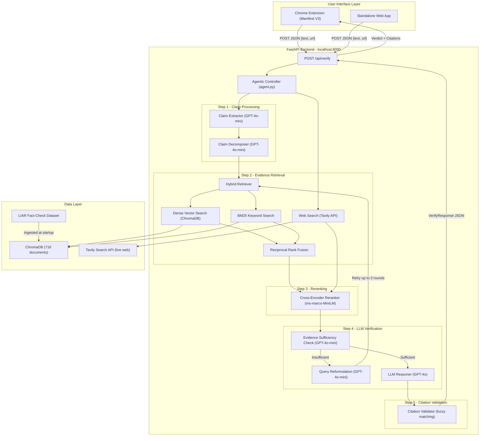
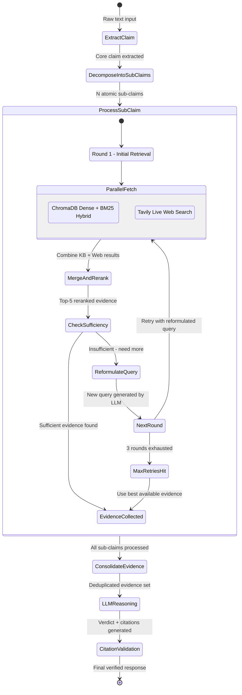
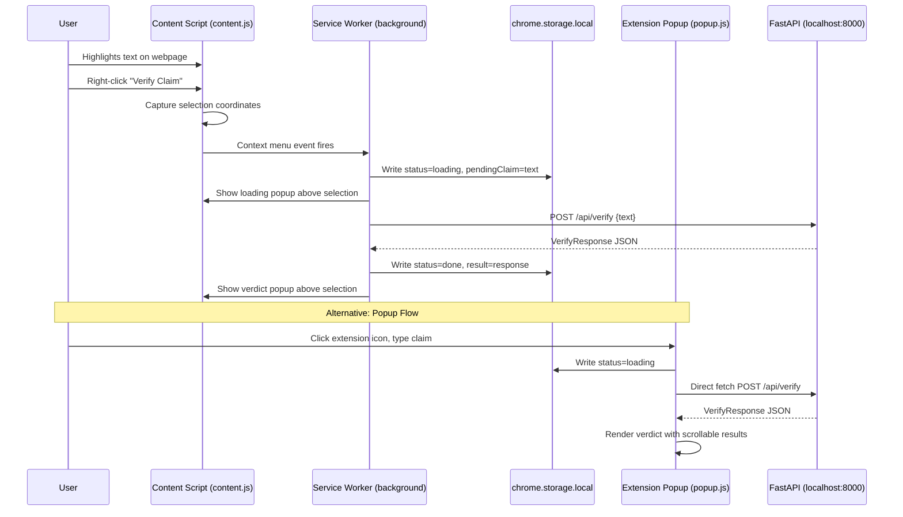

---

## Diagrams

### 1. End-to-End System Architecture

A top-level diagram showing all major components and how data flows from the Chrome extension through the backend pipeline to the verdict response.

### 2. Detailed 8-Step Pipeline Flow

A sequential flow showing exactly what happens at each stage, what data transforms occur, and what each RAG component solves.

```mermaid
flowchart TD
    Input["Raw Text from User"] --> Step1

    subgraph Step1 [Step 1: Claim Extraction]
        S1In["Input: Raw highlighted text (any length)"]
        S1LLM["GPT-4o-mini extracts the core verifiable claim"]
        S1Out["Output: Single factual claim string"]
        S1Problem["Problem Solved: Users highlight messy text - headlines, paragraphs, opinions. This isolates the verifiable factual assertion."]
    end

    Step1 --> Step2

    subgraph Step2 [Step 2: Claim Decomposition]
        S2In["Input: Single claim string"]
        S2LLM["GPT-4o-mini splits compound claims into atomic sub-claims"]
        S2Out["Output: List of 1-N atomic sub-claims"]
        S2Problem["Problem Solved: Complex claims like 'GDP grew 5% AND unemployment fell' need separate verification per fact."]
    end

    Step2 --> Step3

    subgraph Step3 [Step 3: Hybrid Evidence Retrieval]
        S3In["Input: Sub-claim query string"]
        S3Dense["Dense Search: embed query via OpenAI, search ChromaDB top-20 by cosine similarity"]
        S3Sparse["Sparse Search: tokenize query, BM25 keyword match top-20"]
        S3RRF["Reciprocal Rank Fusion merges both ranked lists"]
        S3Out["Output: ~15 merged evidence chunks from knowledge base"]
        S3Problem["Problem Solved: Dense search catches semantic meaning, BM25 catches exact keywords. Fusion ensures high recall."]
    end

    Step3 --> Step4

    subgraph Step4 [Step 4: Live Web Search]
        S4In["Input: Sub-claim query string"]
        S4Tavily["Tavily API returns top-5 web results with extracted text"]
        S4Cache["Results cached 1hr, rate-limited"]
        S4Out["Output: ~5 web evidence chunks with URLs and credibility scores"]
        S4Problem["Problem Solved: Static KB may be outdated. Live web provides real-time evidence for breaking news claims."]
    end

    Step4 --> Step5

    subgraph Step5 [Step 5: Cross-Encoder Reranking]
        S5In["Input: ~20 combined chunks from KB + Web"]
        S5Model["ms-marco-MiniLM-L-6-v2 scores each (query, passage) pair"]
        S5Sort["Sort by relevance score, keep top-5"]
        S5Out["Output: Top-5 most relevant evidence chunks"]
        S5Problem["Problem Solved: Initial retrieval has noise. Cross-encoder deeply understands query-passage relevance, pruning irrelevant results."]
    end

    Step5 --> Step6

    subgraph Step6 [Step 6: Agentic Sufficiency Loop]
        S6In["Input: Sub-claim + top-5 evidence"]
        S6Check["GPT-4o-mini evaluates: Is this evidence sufficient to verify the claim?"]
        S6Yes["YES: Proceed to final reasoning"]
        S6No["NO: Reformulate query and retry (max 3 rounds)"]
        S6Out["Output: Sufficient evidence set OR 'insufficient' flag"]
        S6Problem["Problem Solved: First retrieval may miss key evidence. Agentic loop reformulates the query and searches again for better results."]
    end

    Step6 --> Step7

    subgraph Step7 [Step 7: LLM Verification Reasoning]
        S7In["Input: Original claim + sub-claims + all evidence"]
        S7Context["Evidence formatted as numbered sources with metadata"]
        S7LLM["GPT-4o analyzes evidence, determines verdict"]
        S7Out["Output: Verdict, confidence, reasoning, citations as structured JSON"]
        S7Problem["Problem Solved: The LLM synthesizes multiple evidence sources into a coherent verdict with step-by-step reasoning."]
    end

    Step7 --> Step8

    subgraph Step8 [Step 8: Citation Validation]
        S8In["Input: LLM response with citations"]
        S8Match["Fuzzy match each citation quote against actual retrieved evidence"]
        S8Strip["Strip any citation with match score below 60%"]
        S8Out["Output: Final VerifyResponse with only grounded citations"]
        S8Problem["Problem Solved: LLMs can hallucinate sources. Post-hoc validation ensures every citation is traceable to real evidence."]
    end

    Step8 --> FinalOutput["Final Output: Verdict + Confidence + Reasoning + Verified Citations"]
```

### 3. Agentic RAG Loop Detail

A detailed view of the multi-round retrieval loop that makes this system "agentic."

### 4. Knowledge Base Ingestion Pipeline

How offline data gets into the system.

```mermaid
flowchart LR
    subgraph sources [Data Sources]
        LIAR["LIAR Dataset (1267 fact-checked claims)"]
    end

    subgraph processing [Processing Pipeline - ingest.py]
        Load["Load TSV files"]
        Chunk["Chunk text (512 tokens, 64 overlap)"]
        Batch["Batch 100 documents at a time"]
        Embed["Generate embeddings via OpenAI text-embedding-3-small"]
        Meta["Attach metadata (source, label, credibility)"]
    end

    subgraph storage [Storage]
        Chroma["ChromaDB persistent collection: knowledge_base"]
        BM25Idx["BM25 in-memory index (built on first query)"]
    end

    LIAR --> Load --> Chunk --> Batch --> Embed --> Meta --> Chroma
    Chroma -->|"All text loaded at query time"| BM25Idx
```

### 5. Chrome Extension Data Flow

How the browser extension communicates with the backend.

---

