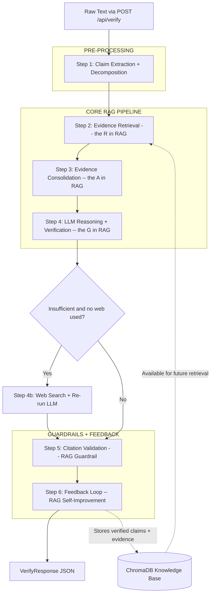
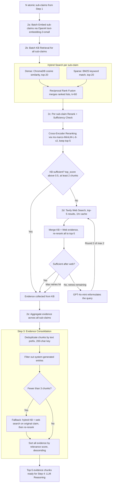
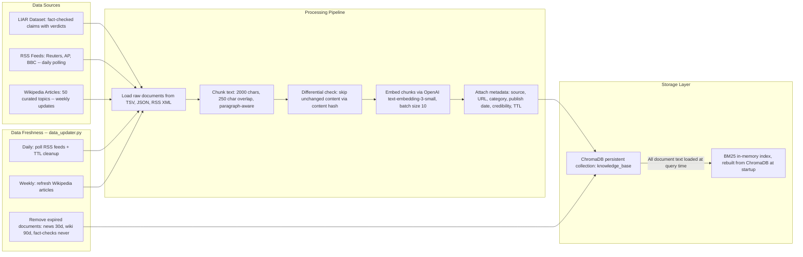

---

## Backend Verification Pipeline Architecture

This document describes the **backend-only** architecture of the Real-Time News Claim Verification System. The backend is a FastAPI application orchestrated by `agent.py`, which runs a 6-step pipeline from raw text input to a verified verdict response.

Each stage below explains:
- **WHAT** it does
- **WHY** it exists
- **RAG ROLE** -- where Retrieval-Augmented Generation comes in

---

### 1. Pipeline Overview

The pipeline receives raw text via `POST /api/verify` and returns a `VerifyResponse` JSON containing a verdict, confidence score, reasoning, per-sub-claim analysis, and validated citations. Steps 2 through 4 form the **core RAG pipeline** where evidence is **Retrieved** from the knowledge base and web, **Augmented** into a context window, and used to **Generate** a grounded verdict. Step 5 acts as a RAG guardrail, and Step 6 closes the loop by feeding verified results back into the knowledge base.

#### Stage-by-Stage Breakdown

**Step 1: Claim Extraction + Decomposition** (`claim_extractor.py`)

- **WHAT**: Takes raw user text (could be a paragraph, headline, or opinion) and (a) extracts the core verifiable factual claim, then (b) splits compound claims into 1-N atomic sub-claims. Uses a heuristic fast-path for short text (<=300 chars, <=3 sentences) or GPT-4o-mini for longer/complex input.
- **WHY**: Users submit messy, unstructured text. A claim like "GDP grew 5% and unemployment fell to 3%" contains two independent facts that each need separate evidence. Decomposition ensures every atomic assertion gets its own retrieval and verification pass.
- **RAG ROLE**: Pre-processing. This stage produces the **queries** that the RAG pipeline will use. No retrieval or generation happens here -- it is purely about understanding what needs to be verified.

**Step 2: Evidence Retrieval** (`retriever.py`, `embedder.py`, `reranker.py`, `web_search.py`)

- **WHAT**: For each sub-claim, retrieves relevant evidence from two sources -- a static knowledge base (ChromaDB) and the live web (Tavily API). Uses hybrid search (dense vector + BM25 keyword), merges results via Reciprocal Rank Fusion, reranks with a cross-encoder model, and checks if evidence is sufficient. If KB evidence is insufficient, falls back to web search with an agentic query reformulation loop (max 2 rounds).
- **WHY**: No single retrieval method is perfect. Dense vector search captures semantic similarity ("inflation rising" matches "price increases") but misses exact terms. BM25 keyword search catches precise matches ("3.2% CPI") but misses paraphrases. Hybrid search + RRF fusion combines both for high recall. Cross-encoder reranking then prunes noise by deeply scoring each (query, passage) pair. Web search handles claims about events not yet in the static KB.
- **RAG ROLE**: This is the **"R" in RAG -- Retrieval**. This stage finds the external evidence that will augment the LLM's generation, ensuring the model reasons over real data rather than relying on its parametric memory alone.

**Step 3: Evidence Consolidation** (`agent.py` inline logic)

- **WHAT**: Aggregates evidence from all sub-claims, deduplicates by text prefix, filters out system-generated entries (previously stored verified claims), runs a fallback search (hybrid KB + web) if fewer than 3 evidence chunks remain, re-reranks if new chunks were added, and sorts all evidence by relevance score descending.
- **WHY**: Multiple sub-claims often retrieve overlapping evidence. Without dedup, the LLM would over-weight repeated passages. The fallback ensures we never send the LLM an effectively empty context. Sorting by relevance means the top-5 chunks passed to the LLM are the strongest available evidence.
- **RAG ROLE**: This is the **"A" bridge in RAG -- Augmentation**. It prepares the augmented context window: the curated, deduplicated, relevance-sorted evidence set that will be injected into the LLM prompt.

**Step 4: LLM Reasoning + Verification** (`reasoner.py`)

- **WHAT**: Assembles the top-5 evidence chunks (400 chars each) into a structured prompt alongside the original claim and sub-claims, calls GPT-4o-mini, and parses its structured JSON response containing: verdict (TRUE / FALSE / MISLEADING / NOT_ENOUGH_EVIDENCE), confidence (0.0-1.0), reasoning, per-sub-claim analysis with supporting/contradicting sources, and citations.
- **WHY**: The LLM synthesizes multiple pieces of evidence into a coherent verdict with step-by-step reasoning. No single evidence chunk contains "the answer" -- the model must cross-reference sources, weigh credibility, and identify contradictions. Structured JSON output ensures the response is programmatically parseable.
- **RAG ROLE**: This is the **"G" in RAG -- Generation**. The LLM generates its verdict **grounded in retrieved evidence** rather than parametric knowledge alone. The evidence context constrains and guides the model, reducing hallucination.

**Step 4b: Web Search Retry** (`web_search.py` + `reasoner.py`) -- *conditional*

- **WHAT**: If Step 4 produces a NOT_ENOUGH_EVIDENCE verdict AND web search was never used during Step 2, performs a one-time web search on the original claim via Tavily API, then re-runs the LLM with the new web-only evidence.
- **WHY**: Some claims have zero KB coverage (very recent events, niche topics). Rather than giving up, the system makes one last attempt to find live web evidence. This is a safety net that maximizes verdict coverage.
- **RAG ROLE**: A second RAG pass -- retrieval (web) followed by generation (LLM re-run) -- triggered only when the first pass was insufficient.

**Step 5: Citation Validation** (`citation_validator.py`)

- **WHAT**: Takes each citation the LLM produced and fuzzy-matches its quoted text against the actual retrieved evidence (threshold: 50% partial ratio via `thefuzz`). Validates that cited URLs are specific (not just domain roots) and come from sources with credibility >= 0.60. Deduplicates URLs. Strips any citation that cannot be traced to real evidence.
- **WHY**: LLMs hallucinate sources -- they fabricate quotes, invent URLs, and cite documents that do not exist. Post-hoc citation validation ensures every citation the user sees is **traceable to real evidence that was actually retrieved** during Step 2. This is critical for user trust.
- **RAG ROLE**: **RAG Guardrail**. This step enforces that the generation (Step 4) stays grounded in the retrieval (Step 2). It is the accountability layer that prevents the RAG system from surfacing ungrounded claims.

**Step 6: Feedback Loop** (`embedder.py` via `store_verified_claim()`)

- **WHAT**: If the verdict is not NOT_ENOUGH_EVIDENCE and confidence >= 0.3, stores the verified claim text, verdict, reasoning, citations, and all evidence chunks back into ChromaDB as a new document with metadata.
- **WHY**: This creates a self-improving knowledge base. Future queries about similar claims can retrieve this previously verified result, leading to faster and more confident verdicts over time. The system learns from its own verified outputs.
- **RAG ROLE**: **RAG Feedback / Self-Improvement**. This closes the RAG loop -- verified outputs become future retrieval inputs. The knowledge base grows with every successful verification, making the "R" stage more effective for subsequent queries.

---

### 2. RAG Deep-Dive: Evidence Retrieval + Consolidation (Steps 2 and 3)

This diagram zooms into the core RAG mechanics -- how sub-claims are turned into evidence. The key insight is that retrieval happens in two phases: a fast **batch KB phase** for all sub-claims at once, then a targeted **per-sub-claim web fallback** only where KB evidence was insufficient. This avoids unnecessary web API calls while ensuring coverage.

#### Retrieval Walkthrough

1. **Batch Embedding (2a)**: All sub-claims are embedded in a single API call to OpenAI `text-embedding-3-small` (1536 dimensions). This avoids N separate API calls and reduces latency.

2. **Batch KB Retrieval (2b)**: For each sub-claim, the system runs **hybrid search** against ChromaDB:
   - **Dense vector search**: Embeds the query, searches ChromaDB by cosine similarity, returns top-20 passages. Catches semantic matches (e.g., "inflation rising" retrieves "consumer prices increasing").
   - **BM25 keyword search**: Tokenizes the query and matches against an in-memory BM25 index built from all ChromaDB documents. Returns top-20. Catches exact term matches (e.g., "3.2% CPI" retrieves documents containing that exact figure).
   - **Reciprocal Rank Fusion (RRF)**: Merges the two ranked lists using the formula `score = 1 / (k + rank)` with `k=60`. A document ranked highly by both methods gets a strong fused score. This ensures high recall without trusting either method alone.

3. **Cross-Encoder Reranking (2c)**: The fused results are reranked by `ms-marco-MiniLM-L-6-v2`, a cross-encoder that scores each (query, passage) pair with full attention. Unlike bi-encoder retrieval (which compares pre-computed embeddings), the cross-encoder sees both texts simultaneously and produces much more accurate relevance scores. Keeps top-5.

4. **Sufficiency Check (2c)**: If the top reranked passage scores above 0.5 and at least 2 chunks are available, KB evidence is deemed sufficient -- no web search needed. This saves Tavily API calls for claims well-covered by the knowledge base.

5. **Web Fallback + Query Reformulation (2d)**: If KB evidence is insufficient, Tavily API provides up to 5 live web results (cached 1 hour, rate-limited to 10 requests/minute). Results are merged with KB evidence and re-reranked. If still insufficient, GPT-4o-mini reformulates the query (e.g., rephrasing, adding context terms) and the system retries. Maximum 2 total rounds.

6. **Evidence Consolidation (Step 3)**: All sub-claim evidence is aggregated, deduplicated (using a 200-character text prefix as key), and system-generated entries are filtered out. If fewer than 3 chunks survive, a fallback search runs the original full claim through hybrid KB + web, then re-reranks. Final evidence is sorted by relevance score descending. The top-5 chunks (max 400 chars each) are sent to the LLM.

---

### 3. Knowledge Base Ingestion Pipeline

The knowledge base is what the RAG pipeline retrieves from. This diagram shows how data enters the system -- both at initial setup and through ongoing updates. Without a well-populated, fresh knowledge base, the "R" in RAG has nothing to retrieve.

#### Ingestion Details

- **LIAR Dataset**: The foundational knowledge base. Contains 1267+ fact-checked political claims with verdicts and metadata. Ingested once at initial setup. These never expire (TTL = 0).

- **RSS Feeds** (`data_updater.py`): Reuters, AP News, and BBC are polled every 24 hours. New articles are chunked, embedded, and stored with a 30-day TTL. A content hash prevents re-embedding unchanged articles on subsequent polls.

- **Wikipedia** (`data_updater.py`): 50 curated topics (political figures, current events, policy areas) are refreshed weekly. Articles are chunked and stored with a 90-day TTL. Differential updates skip articles whose content hash has not changed.

- **Chunking**: Text is split into 2000-character chunks with 250-character overlap. The chunker prefers paragraph boundaries, falling back to sentence boundaries. Overlap ensures that information at chunk borders is not lost.

- **Embedding**: OpenAI `text-embedding-3-small` produces 1536-dimensional vectors. Chunks are embedded in batches of 10 to balance API throughput and rate limits.

- **Metadata**: Every chunk carries `source_name`, `source_url`, `category`, `publish_date`, `credibility_score` (from `sources.py`), `ingested_at`, `expires_at`, and `chunk_index`. This metadata is used during retrieval for credibility filtering and citation validation.

- **BM25 Index**: Built in-memory at startup by loading all document text from ChromaDB. Rebuilt when the ChromaDB collection changes (e.g., after data updates or feedback loop insertions). This enables the sparse keyword search leg of hybrid retrieval.

- **TTL Cleanup**: Runs daily. Removes documents past their expiration date. News articles expire after 30 days, Wikipedia content after 90 days, and fact-check records never expire (they are historical record).

---
