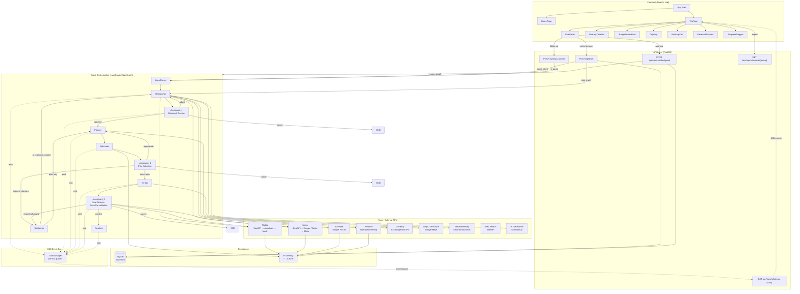
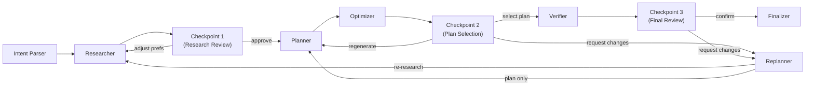
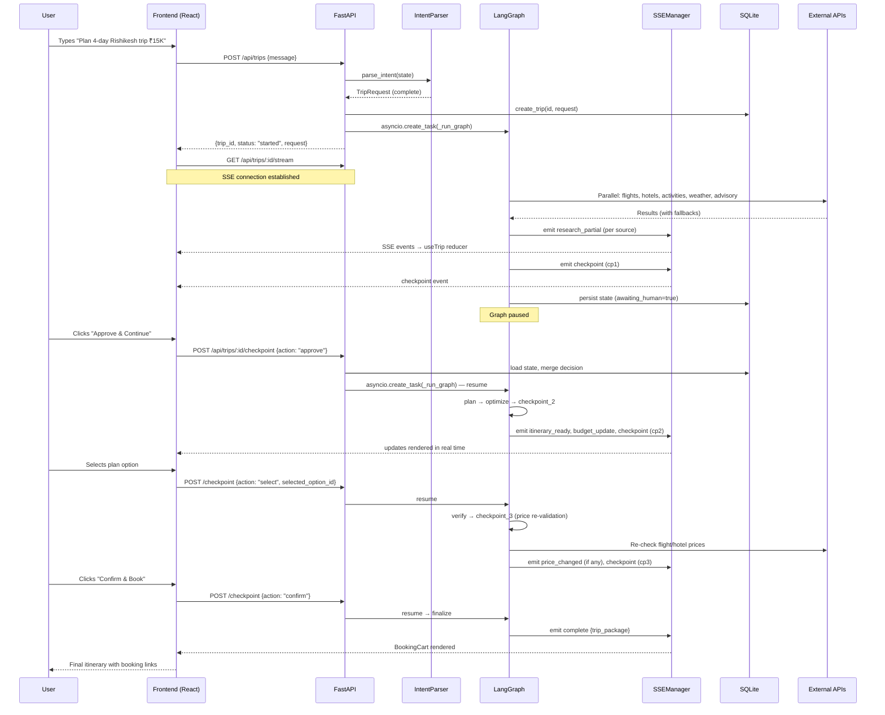

# TripCraft — Architecture Document

## 1. High-Level Overview

**TripCraft** is an AI-powered travel planning agent that takes a natural-language trip request (e.g. *"Plan a 4-day adventure trip to Rishikesh under ₹15,000"*), researches flights/hotels/activities across multiple APIs, builds an optimised day-by-day itinerary, verifies every place via Google Places, and presents the result through a conversational chat UI with three human-in-the-loop approval checkpoints.

### Tech Stack

| Layer | Technology |
|---|---|
| **Frontend** | React 18 + TypeScript, Vite, Tailwind CSS, Framer Motion, Lucide Icons |
| **API** | FastAPI (async), SSE via `sse-starlette` |
| **Agent Orchestration** | LangGraph `StateGraph` (from `langgraph`) |
| **LLM** | OpenAI GPT-4o (reasoning) / GPT-4o-mini (narration) via `langchain-openai` |
| **Database** | SQLite via SQLAlchemy async (`aiosqlite`) |
| **External APIs** | SerpAPI (flights, hotels, web search), Amadeus (flights), Google Places & Maps, OpenWeatherMap, ExchangeRate API, Travel Advisory API |
| **Resilience** | Tenacity retries, per-source circuit breakers, in-memory TTL cache (`cachetools`), mock-data fallback |
| **Export** | Jinja2 HTML templates, WeasyPrint PDF |

---

## 2. Architecture Diagram



### Linearised Agent Pipeline



---

## 3. Backend Architecture

### 3.1 Directory Structure

```
backend/
├── main.py                    # FastAPI entry point, CORS, router mounting, DB init
├── requirements.txt
└── app/
    ├── config.py              # Pydantic BaseSettings — env vars / .env loader
    ├── agents/                # LangGraph agent nodes
    │   ├── graph.py           # StateGraph definition, routing functions, compilation
    │   ├── intent_parser.py   # Heuristic + LLM intent extraction
    │   ├── researcher.py      # Parallel tool calls — flights, hotels, activities, weather, advisory
    │   ├── planner.py         # Heuristic scheduling + LLM narration
    │   ├── optimizer.py       # Greedy budget optimisation
    │   ├── verifier.py        # Google Places verification + dead-link checking
    │   ├── coordinator.py     # Checkpoint gates (cp1, cp2, cp3), finalize, price re-validation
    │   └── replanner.py       # LLM change-request interpretation + heuristic delta
    ├── api/                   # FastAPI routers
    │   ├── trips.py           # Trip CRUD, SSE streaming, checkpoint resume
    │   └── export.py          # PDF / HTML export endpoints
    ├── db/                    # Persistence
    │   ├── database.py        # Async SQLAlchemy engine + session factory
    │   ├── models.py          # ORM model: TripRow
    │   └── seed.py            # Idempotent sample trip seeder (3 demo trips)
    ├── models/                # Pydantic domain models
    │   ├── agent_state.py     # LangGraph TripState TypedDict + ResearchResults
    │   ├── trip.py            # TripRequest, PlanOption, ChatMessage, TripStatus, etc.
    │   ├── itinerary.py       # Itinerary, DayPlan, Activity, TimeSlot, TransportLeg, MealSuggestion
    │   └── booking.py         # FlightOption, HotelOption, ActivityOption, BudgetBreakdown (computed_field), BookingCart, MapMarker, etc.
    ├── services/              # Cross-cutting services
    │   ├── sse_manager.py     # SSEManager singleton — per-trip subscriber queues
    │   ├── trip_service.py    # Trip CRUD operations on TripRow
    │   ├── cache.py           # In-memory TTL cache (cachetools)
    │   └── export_service.py  # Jinja2 HTML / WeasyPrint PDF rendering
    └── tools/                 # External API wrappers
        ├── flights.py         # SerpAPI Google Flights
        ├── flights_amadeus.py # Amadeus Flight Offers API (OAuth2)
        ├── hotels.py          # SerpAPI Google Hotels → Google Places fallback
        ├── activities.py      # Google Places Text Search
        ├── weather.py         # OpenWeatherMap geocode + 5-day forecast
        ├── currency.py        # open.er-api.com exchange rates
        ├── maps.py            # Google Maps Directions + Distance Matrix
        ├── travel_advisory.py # travel-advisory.info scores + country detection
        ├── web_search.py      # SerpAPI Google Search (general)
        ├── iata.py            # Static city-name → IATA code dictionary (~160 entries)
        ├── mock_data.py       # Hardcoded flight/hotel generators (last-resort fallback)
        └── resilience.py      # Circuit breaker + tenacity retry decorator
```

### 3.2 LangGraph StateGraph

Defined in `agents/graph.py`. The graph is compiled once (`get_compiled_graph()` singleton) and executed per trip via `graph.astream(state)`.

**Nodes**

| Node | Function | Module |
|---|---|---|
| `do_research` | `research()` | `researcher.py` |
| `checkpoint_1` | `checkpoint_1()` | `coordinator.py` |
| `plan` | `plan()` | `planner.py` |
| `optimize` | `optimize()` | `optimizer.py` |
| `checkpoint_2` | `checkpoint_2()` | `coordinator.py` |
| `verify` | `verify()` | `verifier.py` |
| `checkpoint_3` | `checkpoint_3()` | `coordinator.py` |
| `finalize` | `finalize()` | `coordinator.py` |
| `replan` | `replan()` | `replanner.py` |

**Edge Routing**

| Source | Condition | Target(s) |
|---|---|---|
| `do_research` | always | `checkpoint_1` |
| `checkpoint_1` | `action == "approve"` | `plan` |
| | `action == "adjust_preferences"` | `do_research` |
| | `action == "cancel"` | `END` |
| `plan` | always | `optimize` |
| `optimize` | always | `checkpoint_2` |
| `checkpoint_2` | `action == "select"` | `verify` |
| | `action == "regenerate"` | `plan` |
| | `action == "request_changes"` | `replan` |
| | `action == "cancel"` | `END` |
| `verify` | always | `checkpoint_3` |
| `checkpoint_3` | `action == "confirm"` | `finalize` |
| | `action == "request_changes"` | `replan` |
| | `action == "cancel"` | `END` |
| `replan` | `delta.re_research_needed` | `do_research` |
| | otherwise | `plan` |
| `finalize` | always | `END` |

**Checkpoint / Human-in-the-Loop Flow**

When a checkpoint node runs, it sets `state["awaiting_human"] = True`, emits an SSE `checkpoint` event, and the `_run_graph` loop detects this flag, persists state to SQLite, and **returns** — pausing execution. The frontend displays approval UI, the user submits a decision via `POST /api/trips/:id/checkpoint`, which writes the `checkpoint_decision` into state, clears `awaiting_human`, and re-launches `_run_graph` with the updated state. Graph routing then reads the decision and picks the next node.

### 3.3 Agent Roles

#### IntentParser (`intent_parser.py`)
- **Runs before the graph** — called inline in `POST /api/trips` and `POST /api/trips/:id/chat`.
- Heuristic regex extraction for budget (`₹`, `$`, `INR`), duration, dates (`"next weekend"`), traveler type, travel styles.
- LLM fallback (GPT-4o) when destination/origin can't be inferred from patterns.
- Returns missing-field follow-up questions or a complete `TripRequest`.
- Budget feasibility check against per-destination minimum cost tables.

#### Researcher (`researcher.py`)
- Resolves origin/destination to IATA codes via `iata.py`.
- Generates 5–8 search queries using GPT-4o-mini based on user preferences.
- Launches **5 parallel async tasks**: flights, hotels, activities, weather, travel advisory.
- Each task has its own fallback chain (see §3.7 Resilience).
- Emits `research_partial` SSE events as each source resolves.

#### Planner (`planner.py`)
- **Heuristic-first**: selects best flight (shortest affordable), best hotel (highest-rated affordable), distributes activities across days (round-robin, max 3/day), schedules into time slots (9 AM–9 PM, 1-hour gaps).
- Budget allocation by travel style (e.g. adventure: 35% activities, 20% transport; luxury: 35% accommodation, 20% food).
- Builds `Itinerary` + `BudgetBreakdown` Pydantic models.
- **LLM narration** (GPT-4o-mini): generates 2 `PlanOption` variants with catchy titles, highlights, and trade-offs.
- Anti-hallucination rule: LLM prompt restricts references to only places in the schedule.

#### Optimizer (`optimizer.py`)
- Pure heuristic — no LLM calls.
- Greedy budget rebalancing: sorts activities by cost (descending), swaps expensive ones with cheaper alternatives from research data in the same category.
- If still over budget, downgrades hotel to next best rated option.
- Recalculates `BudgetBreakdown` with `computed_field` total.

#### Verifier (`verifier.py`)
- Iterates all activities + selected hotel.
- For each unverified place, queries Google Places Text Search to confirm existence.
- Updates activity with `place_id`, coordinates (`lat`/`lng`), and `is_verified = True`.
- Performs HTTP HEAD checks on booking URLs; replaces dead links with Google Search fallbacks.
- Reports verification percentage via SSE.

#### Replanner (`replanner.py`)
- LLM (GPT-4o) interprets free-text change request against current itinerary.
- Classifies change type: `swap_activity`, `change_hotel`, `change_flight`, `extend_trip`, `reschedule`, etc.
- Computes minimal delta: which days to replan, activities to remove/add, whether fresh research is needed.
- Graph routing sends back to `do_research` (full re-research) or `plan` (replan only).

#### Coordinator / Checkpoints (`coordinator.py`)
- **checkpoint_1** — Research review: emits research summary (counts), budget feasibility, serialised research data for frontend preview. Options: `approve_and_continue`, `request_changes`, `cancel`.
- **checkpoint_2** — Plan selection: emits plan options, budget breakdown, itinerary, and map markers. Options: `select_plan`, `request_changes`, `regenerate`.
- **checkpoint_3** — Final review with **price re-validation**: re-calls flight and hotel APIs to detect price changes, emits `price_changed` events, then presents full itinerary + budget + verification results. Options: `confirm_and_book`, `request_changes`, `cancel`.
- **finalize** — Builds `BookingCart` from selected flight + hotel, compiles `TripPackage`, emits `complete` event.

### 3.4 Pydantic Models

#### `trip.py`
- `TravelStyle` — enum: `backpacking`, `comfort`, `luxury`, `adventure`, `spiritual`, `cultural`, `family`, `romantic`
- `TravelerType` — enum: `solo`, `couple`, `family`, `group`
- `TripRequest` — destination, origin, dates, duration, budget, currency, styles, interests, constraints, raw_input. Properties: `is_complete`, `is_international`.
- `PlanOption` — id, label, style, estimated_total, highlights, trade_offs, is_recommended
- `TripStatus` — 13-state enum: `gathering_intent` → `researching` → `checkpoint_1` → `planning` → `checkpoint_2` → `verifying` → `checkpoint_3` → `finalizing` → `complete` (+ `replanning`, `error`, `optimizing`, `ready`)
- `ChatMessage` — role (`user`|`assistant`|`system`), content, metadata
- `CheckpointDecision` — checkpoint id, action, selected_option_id, modifications

#### `itinerary.py`
- `TimeSlot` — start/end times
- `Activity` — name, description, category, time_slot, location, lat/lng, cost, booking_url, place_id, is_verified, research_result_id (anti-hallucination link)
- `TransportLeg` — mode, from/to, cost, booking_url
- `MealSuggestion` — meal_type, name, cuisine, cost_estimate
- `DayPlan` — day_number, title, activities[], transport[], meals[], day_cost, weather_summary
- `Itinerary` — days[], total_cost, selected_flight, selected_hotel

#### `booking.py`
- `FlightOption` — airline, times, duration, price, source (`serpapi`|`amadeus`|`cached`|`mock`)
- `HotelOption` — name, type, rating, price_per_night, amenities, source
- `ActivityOption` — name, category, price, rating, place_id, source
- `BudgetBreakdown` — transport, accommodation, food, activities, buffer, currency, **`total` (Pydantic v2 `@computed_field`)**
- `BookingItem`, `BookingCart` — final checkout items
- `MapMarker`, `MapRoute` — map visualisation data
- `TripPackage` — complete trip output bundle

#### `agent_state.py`
- `ResearchResults(TypedDict)` — flights, hotels, activities, weather, routes, travel_advisory, search_queries
- `TripState(TypedDict)` — the full LangGraph state: trip_id, request, chat_history, status, research, plan_options, itinerary, budget, verification, booking_cart, price_changes, markers, reasoning_log, checkpoint_decision, awaiting_human, replan fields, completion flags

### 3.5 API Endpoints

| Method | Path | Description |
|---|---|---|
| `POST` | `/api/trips` | Create trip — parses intent, starts LangGraph in background. Returns `{trip_id, status, request, budget_feasibility}` or `{status: "needs_info", follow_up}`. |
| `GET` | `/api/trips` | List all trips (including samples) as `TripSummary[]`. |
| `GET` | `/api/trips/:id` | Get single trip row (raw DB record). |
| `POST` | `/api/trips/:id/chat` | Send follow-up message during intent gathering. Re-runs `parse_intent`; starts graph if request is now complete. |
| `POST` | `/api/trips/:id/checkpoint` | Submit `CheckpointDecision` to resume paused graph. |
| `GET` | `/api/trips/:id/stream` | **SSE endpoint** — `EventSourceResponse` streaming typed events. 30 s keepalive. |
| `GET` | `/api/trips/:id/export/html` | Export itinerary as styled HTML page. |
| `GET` | `/api/trips/:id/export/pdf` | Export itinerary as PDF (WeasyPrint). |
| `GET` | `/health` | Health check. |

### 3.6 SSE Streaming

`SSEManager` (singleton at `services/sse_manager.py`) maintains a `dict[trip_id → list[asyncio.Queue]]`. Each SSE subscriber gets a dedicated `asyncio.Queue`. Events are broadcast to all subscribers of a trip.

**Event Types**

| Event | Payload | Emitter(s) |
|---|---|---|
| `phase_update` | `{phase, step, detail}` | All agents |
| `agent_thinking` | `{agent, thought}` | Researcher, Optimizer, Verifier, Replanner |
| `research_partial` | `{source, data}` | Researcher (per-source as results arrive) |
| `api_degraded` | `{source, fallback_used}` | Researcher (SerpAPI → Amadeus, etc.) |
| `checkpoint` | `{type, checkpoint_id, options, ...}` | Coordinator (cp1, cp2, cp3) |
| `plan_ready` | `{options[]}` | Planner |
| `itinerary_ready` | `{itinerary}` | Coordinator (cp2, cp3) |
| `map_update` | `{markers[], routes[]}` | Coordinator (cp2, cp3) |
| `budget_update` | `{breakdown}` | Optimizer, Coordinator |
| `price_changed` | `{item, old_price, new_price}` | Coordinator (cp3 re-validation) |
| `error` | `{message, recovery_options[]}` | Graph runner on exception |
| `complete` | `{trip_package}` | Finalizer |

### 3.7 Tools Layer

#### Flights (`flights.py` + `flights_amadeus.py`)
- **Primary**: SerpAPI `google_flights` engine → parses `best_flights` + `other_flights`, caps at 10 results.
- **Fallback 1**: Amadeus Flight Offers API v2 (OAuth2 token refresh, `test.api.amadeus.com`).
- **Fallback 2**: `generate_mock_flights()` — hardcoded Indian carriers (IndiGo, Air India, SpiceJet), ₹3,500 base / $50 USD, marked `source: "mock"`, `is_verified: false`.
- All wrapped in `@resilient_api_call` + cache.

#### Hotels (`hotels.py`)
- **Primary**: SerpAPI `google_hotels` engine.
- **Fallback**: Google Places Text Search (`{destination} hotels`) — no pricing, `price_per_night = 0`.
- Last resort: `generate_mock_hotels()` — 3 tiers (budget/comfort/premium), marked `source: "mock"`.

#### Activities (`activities.py`)
- Google Places Text Search with LLM-generated queries.
- Category inference from Google Places types (e.g. `hindu_temple` → `spiritual`, `amusement_park` → `adventure`).
- Deduplication by `place_id`.

#### Weather (`weather.py`)
- OpenWeatherMap geocoding → 5-day forecast.
- Returns per-day summary: `temp_min`, `temp_max`, `description`, `rain_prob`.

#### Currency (`currency.py`)
- `open.er-api.com` free tier.
- `convert_amount(amount, from, to)` convenience function.
- Returns `1.0` (identity) on failure.

#### Maps (`maps.py`)
- Google Maps Directions API + Distance Matrix API.
- Returns duration, distance, encoded polyline.

#### Travel Advisory (`travel_advisory.py`)
- `travel-advisory.info` API — advisory score by country code.
- `is_international(origin, destination)` — hardcoded `CITY_COUNTRY` mapping (~50 cities) + `COUNTRY_CODES` (~40 countries).

#### IATA Resolution (`iata.py`)
- Static dictionary of ~160 city → IATA mappings.
- Extensive Indian city coverage including hill stations mapped to nearest airports (e.g. Rishikesh → `DED`, Ooty → `CJB`, Munnar → `COK`).
- `resolve_iata(input)` — returns IATA code or original string if not found.

### 3.8 Resilience

`tools/resilience.py` provides a `@resilient_api_call("source_name")` decorator that wraps any async function with:

1. **Circuit Breaker** — opens after 5 consecutive failures, stays open for 300 s (5 min), then auto-resets. Raises `CircuitOpenError` when open.
2. **Retry** — `tenacity` with 3 attempts, exponential backoff (1–4 s), retries on `httpx.HTTPStatusError` and `httpx.RequestError`.
3. **Failure Tracking** — `record_success()` / `record_failure()` per source.

### 3.9 Caching

`services/cache.py` — in-memory `cachetools.TTLCache` (default: 512 entries, 1-hour TTL).

- Deterministic key: SHA-256 of `{query_type, **params}`.
- Used by all tool modules (flights, hotels, activities, weather, currency, maps, advisory).

### 3.10 Database

- **Engine**: SQLite via `aiosqlite` (async), `check_same_thread=False`.
- **ORM**: SQLAlchemy `DeclarativeBase`.
- **Schema**: Single `trips` table:

| Column | Type | Description |
|---|---|---|
| `id` | `String` PK | UUID |
| `created_at` | `DateTime` | Auto UTC |
| `updated_at` | `DateTime` | Auto UTC on update |
| `status` | `String` | Current `TripStatus` value |
| `last_checkpoint` | `String` nullable | `"cp1"`, `"cp2"`, `"cp3"` |
| `is_sample` | `Boolean` | Seeded demo trip flag |
| `request_json` | `Text` | Serialised `TripRequest` |
| `state_json` | `Text` | Full `TripState` as JSON (checkpoint resume) |
| `research_json` | `Text` | Serialised research results |
| `itinerary_json` | `Text` | Serialised `Itinerary` |
| `budget_json` | `Text` | Serialised `BudgetBreakdown` |

State persistence allows the server to resume a trip's LangGraph execution after a checkpoint pause — the entire `TripState` dict is serialised to `state_json` and reloaded on `POST /checkpoint`.

---

## 4. Frontend Architecture

### 4.1 Setup

- **React 18** with TypeScript, bundled by **Vite**.
- **Tailwind CSS** for styling, **Framer Motion** for animations, **Lucide React** icons.
- Dev server proxies `/api` to backend on port 8000.

### 4.2 Page Structure

```
App
├── Header (logo, New Trip / Home nav)
├── HomePage
│   ├── Hero section + "Start Planning" CTA
│   ├── Sample Trip cards (preloaded from DB seed)
│   └── User Trip history list
└── TripPage (split layout)
    ├── Left panel: ChatPanel
    │   ├── Message list (ChatMessage[])
    │   ├── ApprovalCard (checkpoint actions)
    │   ├── PlanOptionCard (cp2 plan selection)
    │   └── Input bar
    ├── Right panel: Live Preview
    │   ├── ProgressStepper (phase indicator)
    │   ├── ResearchPreview (flights/hotels/activities as they arrive)
    │   ├── ItineraryTimeline → DayCard → ActivityItem
    │   ├── BudgetBreakdown (pie/bar chart)
    │   ├── TripMap (marker visualisation)
    │   └── BookingCart (final checkout links)
    └── ErrorRecovery (retry/start-over on error)
```

### 4.3 State Management

`useTrip()` hook in `hooks/useTrip.ts`:

- Uses React `useReducer` with a `TripState` shape matching the backend.
- **17 action types**: `SET_TRIP_ID`, `SET_STATUS`, `SET_REQUEST`, `ADD_CHAT`, `SET_CHECKPOINT`, `CLEAR_CHECKPOINT`, `SET_PLAN_OPTIONS`, `SET_ITINERARY`, `SET_BUDGET`, `SET_MARKERS`, `ADD_REASONING`, `ADD_PRICE_CHANGE`, `SET_ERROR`, `PARTIAL_RESEARCH`, `SET_RESEARCH`, `COMPLETE`, `RESET`.
- Exposes helper functions: `setTripId`, `addUserMessage`, `addAssistantMessage`, `setRequest`, `reset`.

### 4.4 SSE Integration

`useSSE()` hook in `hooks/useSSE.ts`:

1. Creates `EventSource` via `createSSEConnection(tripId)` → `GET /api/trips/:id/stream`.
2. Registers listeners for 12 named event types: `phase_update`, `agent_thinking`, `research_partial`, `api_degraded`, `price_changed`, `checkpoint`, `plan_ready`, `itinerary_ready`, `map_update`, `budget_update`, `error`, `complete`.
3. Each listener JSON-parses `e.data` and dispatches to `handleSSEEvent` callback.
4. Auto-reconnect is built into the browser `EventSource` spec.
5. `handleSSEEvent` (in `useTrip`) maps each SSE event type to one or more reducer actions:

| SSE Event | Reducer Action(s) |
|---|---|
| `phase_update` | `ADD_CHAT` (system msg) + `SET_STATUS` (phase → status mapping) |
| `agent_thinking` | `ADD_CHAT` (💭 thought) + `ADD_REASONING` |
| `research_partial` | `PARTIAL_RESEARCH` + `ADD_CHAT` |
| `api_degraded` | `ADD_CHAT` (⚠️ warning) |
| `checkpoint` | `SET_CHECKPOINT` + `SET_STATUS` + conditionally `SET_ITINERARY`, `SET_BUDGET`, `SET_RESEARCH` |
| `plan_ready` | `SET_PLAN_OPTIONS` |
| `itinerary_ready` | `SET_ITINERARY` |
| `map_update` | `SET_MARKERS` |
| `budget_update` | `SET_BUDGET` |
| `price_changed` | `ADD_PRICE_CHANGE` |
| `error` | `SET_ERROR` |
| `complete` | `COMPLETE` |

### 4.5 Component Tree

| Component | Location | Purpose |
|---|---|---|
| `App` | `App.tsx` | Router — switches between `HomePage` and `TripPage` |
| `Header` | `components/common/Header.tsx` | Top nav bar |
| `ErrorBoundary` | `components/ErrorBoundary.tsx` | React error boundary wrapper |
| `HomePage` | `pages/HomePage.tsx` | Trip listing, sample cards, new trip CTA |
| `TripPage` | `pages/TripPage.tsx` | Main planning view — split chat + preview layout |
| `ChatPanel` | `components/chat/ChatPanel.tsx` | Message list + input; renders `ApprovalCard` / `PlanOptionCard` inline |
| `ChatMessage` | `components/chat/ChatMessage.tsx` | Single message bubble |
| `ApprovalCard` | `components/chat/ApprovalCard.tsx` | Checkpoint approval buttons |
| `PlanOptionCard` | `components/chat/PlanOptionCard.tsx` | Plan option display for cp2 selection |
| `ProgressStepper` | `components/progress/ProgressStepper.tsx` | Phase indicator (researching → planning → verifying → …) |
| `ResearchPreview` | `components/research/ResearchPreview.tsx` | Live display of incoming flights/hotels/activities during research |
| `ItineraryTimeline` | `components/itinerary/ItineraryTimeline.tsx` | Day-by-day itinerary view |
| `DayCard` | `components/itinerary/DayCard.tsx` | Single day container |
| `ActivityItem` | `components/itinerary/ActivityItem.tsx` | Single activity with time, cost, verification badge |
| `BudgetBreakdown` | `components/budget/BudgetBreakdown.tsx` | Budget category breakdown display |
| `TripMap` | `components/map/TripMap.tsx` | Map with activity/hotel markers |
| `BookingCart` | `components/booking/BookingCart.tsx` | Final booking links |
| `ErrorRecovery` | `components/common/ErrorRecovery.tsx` | Error state with retry/start-over actions |
| `LoadingStates` | `components/common/LoadingStates.tsx` | Skeleton/spinner components |

### 4.6 TypeScript Type System

All interfaces in `types/index.ts` mirror backend Pydantic models:

- `TripRequest`, `TripState`, `TripStatusType`
- `PlanOption`, `Activity`, `DayPlan`, `Itinerary`, `TransportLeg`, `MealSuggestion`
- `BudgetBreakdown`, `BookingItem`, `BookingCart`
- `MapMarker`, `ChatMessage`, `CheckpointData`, `PriceChange`
- `ResearchFlight`, `ResearchHotel`, `ResearchActivity`, `ResearchData`
- `SSEEvent`, `TripSummary`

---

## 5. Data Flow

### 5.1 End-to-End Request Lifecycle



### 5.2 Checkpoint Flow

Three human-in-the-loop gates pause execution and wait for user input:

| Checkpoint | After | Presents | User Actions |
|---|---|---|---|
| **CP1** — Research Review | `do_research` | Research summary (flight/hotel/activity counts), budget feasibility check, travel advisory (if international), full research data for preview | Approve & Continue · Request Changes · Cancel |
| **CP2** — Plan Selection | `optimize` | 2 plan options with highlights/trade-offs, full itinerary, budget breakdown, map markers | Select Plan · Regenerate · Request Changes · Cancel |
| **CP3** — Final Review | `verify` | Verified itinerary, budget breakdown, verification results (% verified), **price re-validation results** (flight/hotel price deltas) | Confirm & Book · Request Changes · Cancel |

**Resume mechanism**: `POST /checkpoint` loads `state_json` from DB, injects `checkpoint_decision`, clears `awaiting_human`, and creates a new `_run_graph` background task. The graph's conditional edge router reads `checkpoint_decision.action` to pick the next node.

### 5.3 Research Data Pipeline

```
User preferences
    → LLM generates 5-8 search queries
    → Parallel API calls:
        Flights:  SerpAPI → Amadeus → mock
        Hotels:   SerpAPI → Google Places → mock
        Activities: Google Places (multi-query, dedup)
        Weather:  OpenWeatherMap (geocode → forecast)
        Advisory: travel-advisory.info
    → Each result cached (1-hour TTL)
    → Each result emitted as SSE `research_partial`
    → Aggregated into TripState.research
    → Frontend `ResearchPreview` renders incrementally
```

---

## 6. Key Design Decisions

### Why LangGraph over plain chains

LangGraph provides a **StateGraph** with conditional edges that naturally models the non-linear flow of human-in-the-loop approvals. The graph can pause at checkpoints (by returning early when `awaiting_human=True`), persist state, and resume from any node after user input — including loops back to research or planning. This is difficult to express with sequential LangChain chains.

### SSE over WebSockets

Server-Sent Events were chosen because:
- The data flow is unidirectional (server → client); user actions go through REST endpoints.
- SSE auto-reconnects natively via the browser `EventSource` API.
- Simpler infrastructure — no WebSocket upgrade negotiation, works through all proxies/CDNs.
- `sse-starlette` integrates cleanly with FastAPI's async generators.

### Human-in-the-loop checkpoints

The three-gate approval model ensures the AI never books or commits without user consent. Each gate adds value:
- **CP1** catches bad research early (wrong destination, budget mismatch) before expensive planning.
- **CP2** gives the user agency over plan style/trade-offs.
- **CP3** re-validates prices (which can change between research and booking), preventing surprise costs.

### Pydantic v2 `computed_field` for budget totals

`BudgetBreakdown.total` is a `@computed_field` property derived from `transport + accommodation + food + activities + buffer`. This ensures the total is always consistent with its components during serialisation — eliminating bugs where a stale `total` diverges from updated sub-fields.

### IATA resolution layer for Indian cities

Many Indian destinations (Rishikesh, Coorg, Ooty, Munnar) don't have their own airports. The `iata.py` module maps these to the nearest airport code (e.g. Rishikesh → `DED` Jolly Grant, Coorg → `MYQ` Mysore). This prevents flight API calls from failing silently on city names.

### Mock data fallback strategy

When all external APIs fail (rate limits, downtime, missing keys), `mock_data.py` generates plausible but clearly-marked (`source: "mock"`, `is_verified: false`) flight and hotel data so the planning pipeline can still demonstrate end-to-end flow. This is critical for development, demos, and graceful degradation.

---

## 7. Environment & Configuration

### Required API Keys

| Key | Service | Required? |
|---|---|---|
| `OPENAI_API_KEY` | OpenAI GPT-4o / GPT-4o-mini | **Yes** — intent parsing, narration, replanning |
| `SERPAPI_API_KEY` | SerpAPI (flights, hotels, web search) | Recommended (falls back to Amadeus/mock) |
| `AMADEUS_API_KEY` + `AMADEUS_API_SECRET` | Amadeus Flight Offers API | Optional (secondary flight source) |
| `GOOGLE_MAPS_API_KEY` / `GOOGLE_PLACES_API_KEY` | Google Maps + Places | Recommended (verification, activities, directions) |
| `OPENWEATHER_API_KEY` | OpenWeatherMap | Optional (weather forecasts) |
| `EXCHANGERATE_API_KEY` | ExchangeRate API | Optional (currency conversion) |

### Configuration

All settings are loaded from `backend/.env` via `app/config.py` (Pydantic `BaseSettings`):

```env
OPENAI_API_KEY=sk-...
LLM_MODEL_REASONING=gpt-4o
LLM_MODEL_NARRATION=gpt-4o-mini
SERPAPI_API_KEY=...
GOOGLE_MAPS_API_KEY=...
GOOGLE_PLACES_API_KEY=...
AMADEUS_API_KEY=...
AMADEUS_API_SECRET=...
OPENWEATHER_API_KEY=...
EXCHANGERATE_API_KEY=...
DATABASE_URL=sqlite+aiosqlite:///./tripcraft.db
CACHE_TTL_SECONDS=3600
CACHE_MAX_SIZE=512
```

### Running the Application

**Backend:**
```bash
cd backend
pip install -r requirements.txt
uvicorn main:app --reload --host 0.0.0.0 --port 8000
```

**Frontend:**
```bash
cd frontend
npm install
npm run dev   # Vite dev server on :5173, proxies /api → :8000
```

The app will be available at `http://localhost:5173`. The backend seeds 3 sample trips (Rishikesh, Goa, Coorg) on first startup.
