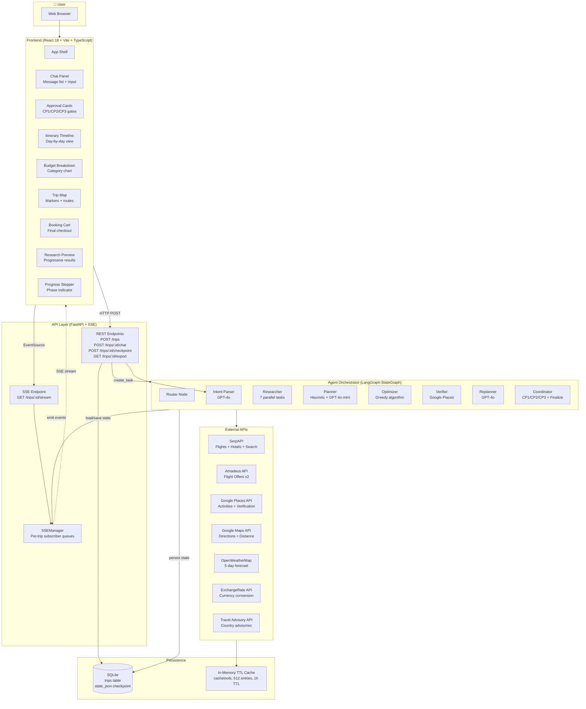
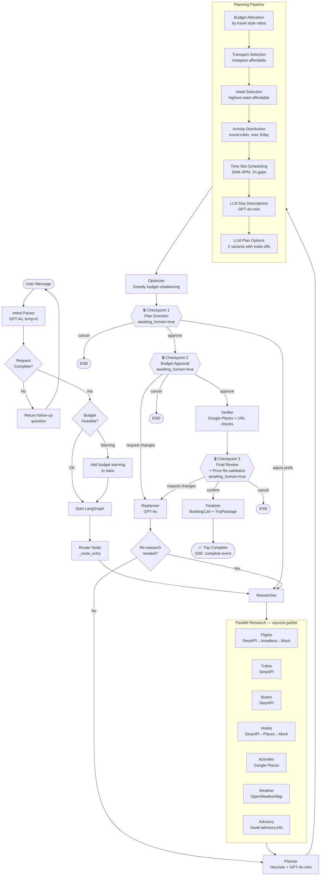
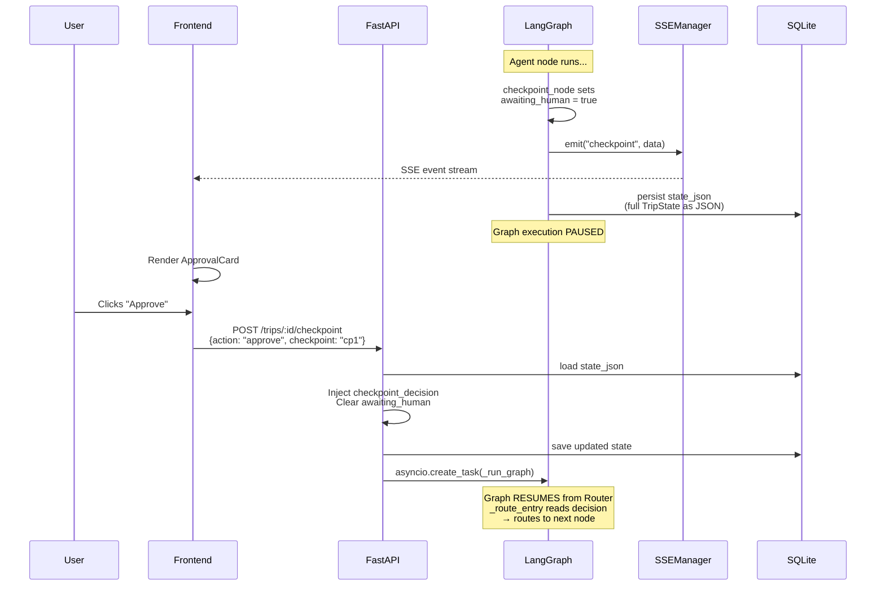
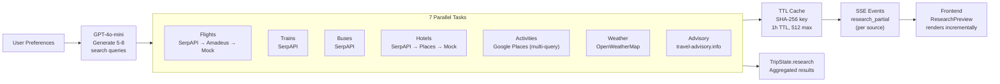
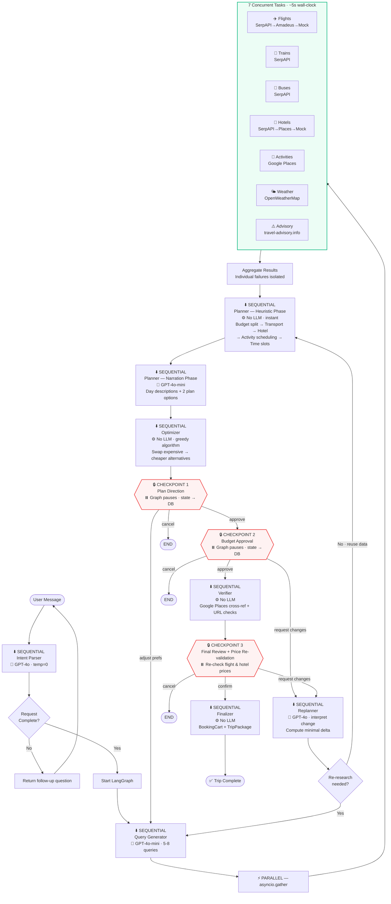

# TripCraft — Architecture Deep Dive & Technical Presentation

---

## 1️⃣ High-Level Architecture Overview

### Why This Architecture Was Chosen

TripCraft uses a **LangGraph StateGraph-based multi-agent orchestration** pattern. This was chosen over alternatives (CrewAI, AutoGen, plain LangChain chains) for three critical reasons:

1. **Non-linear workflow with human gates** — Travel planning is not a simple pipeline. The workflow must pause at three human-approval checkpoints, persist state, and resume from any node after user input—including loops back to earlier stages. LangGraph's `StateGraph` with conditional edges models this naturally. Sequential LangChain chains cannot express this without manual workarounds.

2. **Shared mutable state** — All agents operate on a single `TripState` TypedDict (30+ fields). Each agent reads from and writes to this shared state object, which flows through the graph. This eliminates the need for inter-agent message passing, reduces hallucination risk (agents reference the same research data), and makes checkpoint serialization trivial (JSON-dump the entire state).

3. **Deterministic control flow with LLM reasoning** — The orchestration logic (which agent runs next, conditional branching) is entirely deterministic (Python routing functions). The LLM is used **only** for reasoning within individual agents (intent extraction, narration, change interpretation), never for deciding workflow routing. This gives predictable behavior while retaining AI intelligence where it matters.

### Agent Decomposition Philosophy

Agents are decomposed by **cognitive function**, not by data domain:

| Cognitive Function | Agent | Why Separated |
|---|---|---|
| **Understanding** | Intent Parser | Requires structured extraction — different LLM prompt and temperature (0) vs creative agents |
| **Research** | Researcher | I/O-bound, parallel API calls — benefits from `asyncio.gather` isolation |
| **Scheduling** | Planner | Heuristic-first with LLM narration — deterministic scheduling ensures feasibility |
| **Cost Control** | Optimizer | Pure heuristic (no LLM) — greedy algorithm, fast, deterministic |
| **Verification** | Verifier | External validation — cross-references against Google Places, checks URLs |
| **Change Handling** | Replanner | Requires GPT-4o reasoning to interpret free-text changes against existing itinerary |
| **Orchestration** | Coordinator | Checkpoint gating, price re-validation, final package compilation |

### Orchestration Model

The graph uses a **linear pipeline with conditional loops**:

```
Router → Research → Plan → Optimize → CP1 → CP2 → Verify → CP3 → Finalize → END
```

With conditional back-edges:
- CP1 → Research (adjust preferences)
- CP2 → Replan → Research or Plan (request changes)
- CP3 → Replan → Research or Plan (request changes)

The `Router` node is a pass-through that uses a conditional edge (`_route_entry`) to dispatch to the correct starting node based on checkpoint state — enabling graph resumption after human approval.

### State & Memory Sharing

All agents share a single `TripState` TypedDict containing 30+ fields:

- **Input context**: `request`, `chat_history`, `current_message`
- **Research data**: `research` (flights, hotels, activities, weather, advisory, search queries)
- **Planning artifacts**: `plan_options`, `itinerary`, `budget_breakdown`
- **Verification**: `verification_results`, `unverified_places`
- **Booking**: `booking_cart`, `price_changes`
- **Control flow**: `status`, `last_checkpoint`, `checkpoint_decision`, `awaiting_human`
- **Replanning**: `replan_request`, `replan_delta`, `replan_analysis`
- **Reasoning transparency**: `reasoning_log`, `warnings`

State is persisted to SQLite (`state_json` column) at every checkpoint, enabling crash-safe resumption.

### Human Approval Injection

Three checkpoint gates pause execution:

1. **CP1 (Plan Direction)** — After research + planning + optimization. Presents trip understanding, plan options, research summary, budget feasibility.
2. **CP2 (Budget Approval)** — After CP1 approval. Presents budget breakdown for confirmation.
3. **CP3 (Final Review)** — After verification. Re-validates prices in real-time, presents verified itinerary + booking options.

**Mechanism**: When a checkpoint node runs, it sets `state["awaiting_human"] = True` and emits an SSE `checkpoint` event. The `_run_graph` loop detects this flag, persists the full `TripState` to SQLite as JSON, and returns — pausing execution. The frontend renders approval UI. The user submits a decision via `POST /api/trips/:id/checkpoint`, which loads `state_json` from DB, injects `checkpoint_decision`, clears `awaiting_human`, and spawns a new `_run_graph` background task. The graph's conditional edge router reads `checkpoint_decision.action` to pick the next node.

### Re-planning

Re-planning is triggered by user change requests at CP2 or CP3 ("reduce budget to ₹10,000", "swap day 2 activity"). The Replanner agent:

1. Uses GPT-4o to interpret the free-text change against the current itinerary
2. Classifies the change type (`swap_activity`, `change_hotel`, `extend_trip`, `change_budget`, etc.)
3. Computes a minimal delta: which days to replan, what to add/remove
4. Determines if fresh API research is needed or if replanning from existing data suffices
5. Routes back to `do_research` (full re-research) or `plan` (replan only)

---

## 2️⃣ Agent Breakdown Table

| Agent | Responsibility | Inputs | Outputs | Tools / APIs | Reasoning Strategy | Trigger Condition | Execution Type |
|---|---|---|---|---|---|---|---|
| **Intent Parser** | Extract structured `TripRequest` from natural language | `chat_history`, `current_message` | `TripRequest` (destination, origin, budget, dates, styles, interests), missing-field follow-ups | GPT-4o (temp=0) | LLM-first extraction with structured JSON output. Handles Indian budget formats (₹15k, 2 lakh). Date resolution ("next weekend" → actual date). Budget feasibility check against per-destination minimums. | User sends first message or follow-up during intent gathering | **Sequential** — runs before graph, inline in POST /api/trips |
| **Researcher** | Parallel real-time data collection across all travel domains | `TripRequest` (destination, origin, dates, budget, styles) | `ResearchResults` with flights, trains, buses, hotels, activities, weather, travel advisory | GPT-4o-mini (query generation), SerpAPI Flights, Amadeus API, SerpAPI Hotels, Google Places, OpenWeatherMap, Travel Advisory API, IATA resolver | LLM generates 5-8 targeted search queries from user preferences. 7 parallel `asyncio.create_task` calls with cascading fallbacks per source. Each result emitted as SSE `research_partial` for progressive UI updates. | Graph entry or re-research after replan | **Parallel** — all 7 research tasks run concurrently via `asyncio.gather` |
| **Planner** | Build day-by-day itinerary from research data | `TripRequest`, `ResearchResults` | `Itinerary` (days, activities, transport, meals), `BudgetBreakdown`, `PlanOption[]` (2 variants) | GPT-4o-mini (narration + day descriptions) | **Heuristic-first**: budget allocation by travel style ratios → transport selection (cheapest affordable, shortest duration tiebreaker) → hotel selection (highest-rated affordable) → round-robin activity distribution (max 3/day) → sequential time slot scheduling (9AM-9PM, 1h gaps). **LLM narration**: generates day titles, descriptions, and 2 plan option variants with highlights/trade-offs. Anti-hallucination rule in prompts. | After research completes | **Sequential** — heuristic scheduling then LLM narration |
| **Optimizer** | Greedy budget rebalancing to fit within user's budget | `Itinerary`, `BudgetBreakdown`, `ResearchResults`, budget limit | Optimized `Itinerary`, updated `BudgetBreakdown`, `reasoning_log[]` | None (pure heuristic) | **Greedy algorithm**: Sort all activities by cost descending → swap expensive ones with cheaper same-category alternatives from research data → if still over budget, downgrade hotel to next-best-rated cheaper option → recalculate totals. Produces transparent reasoning log of every swap. | After planning completes | **Sequential** — deterministic, no LLM |
| **Verifier** | Cross-reference all places against Google Places; check booking URLs | `Itinerary` (all activities + hotel) | `verification_results[]` with place_ids, coordinates, ratings; updated activity records | Google Places Text Search API, HTTP HEAD checks on booking URLs | For each unverified place: query Google Places → confirm existence → extract place_id, coordinates, rating → update activity record. For each booking URL: HTTP HEAD check → replace dead links with Google Search fallback URLs. Reports verification percentage. | After plan selection (CP2 approval) | **Sequential** — iterates places one-by-one to respect API rate limits |
| **Replanner** | Interpret user change requests and compute minimal re-work delta | `replan_request` (free text), current `Itinerary`, `TripRequest` | `replan_delta` (change type, affected days, activities to remove/add, re-research flag), updated `TripRequest` | GPT-4o (temp=0.2) for change interpretation | LLM classifies change type into 8 categories. Heuristic delta computation determines minimal re-work. Applies request modifications (new duration, budget, destination). Removes specified activities. Clears stale checkpoint decisions. Routes to re-research or re-plan. | User selects "Request Changes" at CP2 or CP3 | **Sequential** — LLM interpretation then heuristic delta |
| **Coordinator** | Checkpoint gating, price re-validation, final package compilation | Full `TripState` | SSE checkpoint events, `BookingCart`, `TripPackage` | SerpAPI Flights (re-validation), SerpAPI Hotels (re-validation) | **CP1**: Builds trip understanding summary, serializes research for preview, checks budget feasibility. **CP2**: Emits budget breakdown for approval. **CP3**: Re-calls flight and hotel APIs to detect price changes since research, emits `price_changed` events. **Finalize**: Compiles `BookingCart` with booking items and URLs, builds `TripPackage`, emits `complete` SSE event. | After optimize (CP1), after CP1 approval (CP2), after verify (CP3), after CP3 approval (finalize) | **Conditional** — checkpoints pause execution; finalize is sequential |

---

## 3️⃣ Orchestration Logic

### Entry Point

`POST /api/trips` → `parse_intent()` (inline, before graph) → if request complete → `asyncio.create_task(_run_graph(state))` → `get_compiled_graph().astream(state)`

If intent is incomplete, the trip is created in DB with `status: gathering_intent` and follow-up questions are returned. `POST /api/trips/:id/chat` handles subsequent messages until the request is complete.

### Workflow Stages

```
Stage 0: Intent Parsing (pre-graph, inline in API handler)
    ↓
Stage 1: Router (dispatches to correct starting node based on checkpoint state)
    ↓
Stage 2: Research (7 parallel async tasks: flights, trains, buses, hotels, activities, weather, advisory)
    ↓
Stage 3: Planning (heuristic scheduling → LLM narration → plan options)
    ↓
Stage 4: Optimization (greedy budget rebalancing, no LLM)
    ↓
Stage 5: Checkpoint 1 — Plan Direction + Research Review
    ↓ [user approves]
Stage 6: Checkpoint 2 — Budget Approval
    ↓ [user approves]
Stage 7: Verification (Google Places cross-reference + URL checks)
    ↓
Stage 8: Checkpoint 3 — Final Review + Price Re-validation
    ↓ [user confirms]
Stage 9: Finalization (BookingCart compilation + TripPackage emission)
    ↓
END
```

### Parallel vs Sequential Execution

| Stage | Execution Model | Details |
|---|---|---|
| Research | **Parallel** | 7 `asyncio.create_task` calls gathered with `asyncio.gather(return_exceptions=True)` — flights, trains, buses, hotels, activities, weather, advisory all run concurrently |
| Planning | **Sequential** | Heuristic scheduling → LLM narration → LLM day descriptions → LLM plan options (4 sequential LLM calls) |
| Optimization | **Sequential** | Pure Python greedy algorithm, no I/O |
| Verification | **Sequential** | Iterates places one-by-one (Google Places API rate limits) |
| Price Re-validation (CP3) | **Sequential** | Re-calls flight API then hotel API |

### Conditional Branching Logic

All routing is handled by deterministic Python functions — no LLM decides the next agent.

```
_route_entry(state):
    if checkpoint_decision exists for cp1:
        cancel → END
        adjust_preferences → do_research
        regenerate → plan
        default → checkpoint_2
    if checkpoint_decision exists for cp2:
        cancel → END
        request_changes → replan
        default → verify
    if checkpoint_decision exists for cp3:
        cancel → END
        request_changes → replan
        default → finalize
    if replan_delta exists:
        re_research_needed → do_research
        else → plan
    default → do_research (fresh start)

_after_replan(state):
    if delta.re_research_needed → do_research
    else → plan
```

### Retry and Fallback Strategy

**Per-tool fallback chains:**

| Tool | Primary | Fallback 1 | Fallback 2 (Last Resort) |
|---|---|---|---|
| Flights | SerpAPI Google Flights | Amadeus Flight Offers API v2 | `generate_mock_flights()` — hardcoded carriers, marked `source: "mock"` |
| Hotels | SerpAPI Google Hotels | Google Places Text Search | `generate_mock_hotels()` — 3 tiers, marked `source: "mock"` |
| Activities | Google Places Text Search | — | — (returns empty list) |
| Weather | OpenWeatherMap | — | Returns empty dict |

**Resilience decorator (`@resilient_api_call`):**
- Circuit breaker: opens after 5 consecutive failures, stays open 300s, auto-resets
- Retry: 3 attempts, exponential backoff (1-4s), via `tenacity`
- Failure tracking per source

**Error handling in `asyncio.gather`:**
- `return_exceptions=True` — individual task failures don't crash the entire research phase
- Each result is checked with `isinstance(result, Exception)` before processing
- Failed tasks log errors but don't block the pipeline

### Edge-Case Handling

| Edge Case | Handling |
|---|---|
| **Budget too low** | `check_budget_feasibility()` uses per-destination minimum cost tables (e.g., Rishikesh ₹2000/day, Paris ₹12000/day). If budget is below minimum, a warning is included in CP1 data but planning proceeds. |
| **No flights found** | Cascading fallback: SerpAPI → Amadeus → mock data. Mock flights are marked `source: "mock"`, `is_verified: false`. Ground transport (trains, buses) searched in parallel. |
| **No hotels found** | Cascading fallback: SerpAPI Hotels → Google Places → mock hotels. Mock hotels marked with `source: "mock"`. |
| **Activities fully booked / unavailable** | Google Places doesn't return availability; activities are best-effort. Verifier checks place existence and replaces dead booking URLs with Google Search fallback. |
| **API keys missing** | Individual tool modules check for key presence; return empty results instead of crashing. Mock data provides last-resort fallback. |
| **Destination without airport** | `iata.py` maps ~160 cities (including Indian hill stations) to nearest airports. E.g., Rishikesh → DED, Ooty → CJB, Munnar → COK. |
| **Activity prices unknown** | `_estimate_activity_costs()` uses category-based heuristics (spiritual: ₹0-100, adventure: ₹500-2000) scaled to fit within budget allocation. |

---

## 4️⃣ Architecture Diagrams (Mermaid)

### A. System Context Diagram



### B. Detailed Agent Orchestration Flow



### C. Checkpoint & State Persistence Flow



### D. Research Data Pipeline



### E. Agent Execution Flow — Parallel vs Sequential



**Legend**: ⬇️ SEQUENTIAL = runs one-at-a-time in pipeline order · ⚡ PARALLEL = concurrent tasks via `asyncio.gather` · 🧠 = LLM call · ⚙️ = pure heuristic (no LLM) · 🔒 = human-in-the-loop checkpoint (graph pauses, state persisted to DB)

---

## 5️⃣ Memory & Context Strategy

### Short-Term Conversational Memory

- `TripState.chat_history: list[ChatMessage]` — accumulates all user/assistant/system messages
- Used by Intent Parser to build a comprehensive text block from all user messages
- Each agent can append system messages to chat_history for transparency

### Shared Workflow State Object

The `TripState` TypedDict is the **single source of truth** across all agents:

```python
class TripState(TypedDict, total=False):
    # Identity
    trip_id: str

    # User Input
    request: TripRequest           # Structured extraction of user intent
    chat_history: list[ChatMessage] # Full conversation
    current_message: str

    # Pipeline Data
    research: ResearchResults      # Flights, hotels, activities, weather, advisory
    plan_options: list[PlanOption]  # Generated plan variants
    itinerary: Optional[Itinerary] # Day-by-day schedule
    budget_breakdown: Optional[BudgetBreakdown]

    # Verification
    verification_results: list[dict]  # Google Places cross-reference

    # Booking
    booking_cart: Optional[BookingCart]
    price_changes: list[dict]      # CP3 re-validation deltas

    # Control Flow
    status: TripStatus             # 13-state enum
    last_checkpoint: Optional[str] # "cp1", "cp2", "cp3"
    checkpoint_decision: Optional[dict]
    awaiting_human: bool

    # Replanning
    replan_request: Optional[str]
    replan_delta: Optional[dict]
    replan_analysis: Optional[dict]

    # Transparency
    reasoning_log: list[str]       # Optimizer swap decisions
    warnings: list[str]

    # Completion Flags
    research_complete: bool
    planning_complete: bool
    verification_complete: bool
    optimization_complete: bool
```

**Key property**: State is pass-by-reference through the graph. Each agent mutates the same dict and returns it. No copying, no message passing.

### Budget Tracking State

`BudgetBreakdown` uses Pydantic v2 `@computed_field`:

```python
class BudgetBreakdown(BaseModel):
    transport: float
    accommodation: float
    food: float
    activities: float
    buffer: float
    currency: str
    traveler_count: int = 1

    @computed_field
    @property
    def total(self) -> float:
        return self.transport + self.accommodation + self.food + self.activities + self.buffer
```

This ensures the `total` is **always consistent** with component fields during serialization — eliminating stale-total bugs.

### Agent Reasoning Logs

- `reasoning_log: list[str]` — Populated by the Optimizer with every swap decision (e.g., "Swapped 'Cliff Jumping' (cost: 1500) → 'River Walk' (cost: 200). Saved: 1300")
- SSE `agent_thinking` events broadcast agent reasoning in real-time to the frontend
- Replanner emits change analysis reasoning via SSE

### Hallucination Prevention

| Mechanism | Where | How |
|---|---|---|
| Anti-hallucination prompt rule | Planner (plan options, day descriptions) | "Only reference places that appear in the schedule above. Do not invent new places." |
| `research_result_id` backlink | Activity model | Each scheduled activity links to its source research result via ID |
| `is_verified` flag | Activity model | Set `true` only when Google Places confirms existence |
| `source` field | FlightOption, HotelOption | Tracks data provenance: `serpapi`, `amadeus`, `google_places`, `cached`, `mock` |
| Verifier agent | Post-planning | Cross-references every place against Google Places API; reports verification percentage |
| Mock data marking | Tool layer | Mock fallback data explicitly marked `source: "mock"`, `is_verified: false` |

### Validation Mechanisms

1. **Budget feasibility check** — Per-destination minimum cost lookup tables (e.g., Rishikesh ₹2000/day/person) checked at intent parsing and CP1
2. **Pydantic model validation** — All domain objects (`TripRequest`, `Itinerary`, `BudgetBreakdown`, `FlightOption`, etc.) are Pydantic v2 `BaseModel` with type validation
3. **Price re-validation** — CP3 re-calls flight and hotel APIs to detect price changes between research and booking
4. **URL liveness checks** — Verifier performs HTTP HEAD checks on booking URLs; replaces dead links
5. **Google Places verification** — Cross-references every suggested place; reports percentage verified

---

## 6️⃣ AI Components Deep Dive

### LLM Usage — Dual-Model Strategy

TripCraft uses a **tiered two-model strategy** to balance reasoning quality with cost:

| Model | Temperature | Use Cases | Why |
|---|---|---|---|
| **GPT-4o** | 0 – 0.2 | Intent parsing, replanning change interpretation | Requires precise structured extraction and complex reasoning against existing itinerary context. Zero/low temperature for determinism. |
| **GPT-4o-mini** | 0.3 – 0.7 | Search query generation, plan narration, day descriptions | High-volume creative text generation. ~15x cheaper than GPT-4o. Higher temperature for variety. |

**Cost control**: GPT-4o is used in only 2 agents (Intent Parser, Replanner). All other LLM work uses GPT-4o-mini. The Optimizer uses no LLM at all.

### Prompt Engineering Strategy

| Agent | Prompt Pattern | Key Techniques |
|---|---|---|
| Intent Parser | Structured JSON extraction | Explicit field schema in prompt, ISO date format specification, budget conversion rules ("2 lakh" → 200000), "Return ONLY valid JSON, no markdown fences" |
| Researcher | Query generation | Few-shot example in prompt, destination/style/interest context, "Return ONLY a JSON array" |
| Planner (narration) | Creative with constraints | Anti-hallucination rule, specific schedule reference, JSON output format, two-option generation |
| Planner (day descriptions) | Constrained creative | "Only reference the activities listed above", JSON output |
| Replanner | Change classification | Full itinerary context in prompt, 8-category change taxonomy, request modification fields, "Return ONLY the JSON object" |

**Common patterns across all prompts**:
- Explicit output format specification (JSON schema in prompt)
- "Return ONLY" instructions to prevent explanation text
- Markdown fence stripping in response parsing (`re.sub(r"^```[a-z]*\n?", "", content)`)
- `try/except` with graceful fallback on parse failure

### Tool-Calling Mechanism

TripCraft does **not** use LangChain's native tool-calling abstraction. Instead:

1. **Direct function calls**: Each tool is a regular `async def` function (e.g., `search_flights()`, `search_hotels()`)
2. **Agent orchestrates calls**: The Researcher agent manually constructs 7 `asyncio.create_task()` calls
3. **No agent autonomy over tool selection**: Which tools to call is hardcoded per agent, not decided by the LLM

This was a deliberate choice for **reliability and cost control** — the LLM never decides which API to call, it only processes the results.

### Guardrails

| Guardrail | Implementation |
|---|---|
| Budget limit enforcement | Optimizer uses greedy algorithm to bring total under budget before presenting to user |
| No hallucinated places | Anti-hallucination prompt rules + `research_result_id` backlinks + Verifier cross-reference |
| No hallucinated prices | All prices from API data or category-based estimates (transparent); mock data explicitly marked |
| Output format enforcement | JSON parsing with regex fence-stripping; fallback responses on parse failure |
| Temperature control | 0 for extraction/classification, 0.3-0.7 for creative generation |
| Token output capping | "Return ONLY..." instructions prevent verbose LLM responses |

### Deterministic vs Creative Stages

| Stage | Type | Rationale |
|---|---|---|
| Intent parsing (extraction) | **Deterministic** (temp=0) | Must produce consistent structured data |
| Search query generation | **Semi-creative** (temp=0.3) | Benefit from variety but need relevant queries |
| Budget allocation | **Deterministic** (ratio tables) | Fixed ratios per travel style — no LLM |
| Transport/hotel selection | **Deterministic** (sorting) | Cheapest affordable / highest-rated affordable |
| Activity scheduling | **Deterministic** (round-robin) | Sequential time slots, no LLM |
| Day descriptions | **Creative** (temp=0.6) | Engaging prose, variety acceptable |
| Plan option narratives | **Creative** (temp=0.7) | Catchy titles, highlight text |
| Budget optimization | **Deterministic** (greedy) | Pure heuristic — no LLM |
| Verification | **Deterministic** (API lookup) | Google Places existence check |
| Change interpretation | **Semi-deterministic** (temp=0.2) | Must classify accurately, low creativity |

---

## 7️⃣ Decision-Making Strategy

### Trade-Off Handling (Budget vs Comfort)

The system handles budget-comfort trade-offs through a layered strategy:

1. **Budget allocation ratios by travel style** — Different styles prioritize different cost categories:

| Style | Transport | Accommodation | Food | Activities | Buffer |
|---|---|---|---|---|---|
| Backpacking | 15% | 25% | 20% | 25% | 15% |
| Comfort | 25% | 30% | 15% | 20% | 10% |
| Luxury | 20% | 35% | 20% | 15% | 10% |
| Adventure | 20% | 20% | 15% | 35% | 10% |

2. **Selection prioritization** — Transport: cheapest affordable with shortest duration as tiebreaker. Hotel: highest-rated within nightly budget. This implicitly balances cost vs quality.

3. **Optimizer greedy swaps** — When over budget, activities are sorted by cost (descending) and swapped with cheaper same-category alternatives, preserving the thematic experience while reducing cost. Hotel downgrade is the last resort.

### Scoring Model

There is no explicit numerical scoring model. Selection uses **filter-then-rank**:

- **Transport**: Filter to affordable (price ≤ budget allocation / traveler count) → Rank by `duration_minutes` ascending
- **Hotel**: Filter to affordable (price_per_night ≤ accommodation budget / nights) → Rank by `rating` descending
- **Activities**: No filtering — distributed by round-robin. Costs estimated by category heuristics if unknown.

If no affordable options exist, the cheapest option is selected regardless (the optimizer will handle budget overrun).

### Optimization Logic

The Optimizer runs a **single-pass greedy algorithm**:

```
1. Compute current total from budget breakdown components
2. If total ≤ budget_limit → return (no changes needed)
3. Collect all scheduled activities across all days
4. Sort by cost (descending) — most expensive first
5. For each activity (while saved < over_budget):
    a. Find cheaper alternative in same category from research data
    b. If found: swap, record saving in reasoning_log
6. If still over budget:
    a. Find cheaper hotel with acceptable rating from research data
    b. If found: swap hotel, record saving
7. Recalculate BudgetBreakdown with new totals
```

**Why greedy over optimal**: The constraint space is small (typically 5-10 activities, 3-5 hotels). Greedy produces near-optimal results in O(n) time without the complexity of ILP solvers.

### Constraint Satisfaction

| Constraint | Enforcement |
|---|---|
| Budget limit | Optimizer ensures total ≤ user budget |
| Max 3 activities per day | `_distribute_activities()` enforces hard cap |
| Time slots 9AM–9PM | `_build_time_slots()` stops scheduling at 21:00 |
| 1-hour gaps between activities | Built into time slot allocation |
| Per-destination minimum budget | `check_budget_feasibility()` warns at CP1 |
| Place existence | Verifier cross-references against Google Places |
| Booking URL validity | Verifier checks via HTTP HEAD |

### Re-Ranking Logic

When the Optimizer swaps activities, it re-ranks alternatives by:
1. **Same category** (must match — e.g., "adventure" for "adventure")
2. **Lower cost** (must be cheaper than current)
3. **Highest rating** (among cheaper alternatives, prefer the best-rated)

For hotel downgrade:
1. **Lower price_per_night** (must be cheaper)
2. **Different name** (must be a different hotel)
3. **Highest rating** (among cheaper hotels, prefer best-rated)

---

## 8️⃣ Human-in-the-Loop Integration

### Checkpoint Architecture

Each checkpoint follows the same pattern:

```
Agent Node → sets awaiting_human=true → emits SSE checkpoint event → 
    _run_graph detects flag → persists TripState to DB → returns (graph paused)
    
User → Frontend → POST /checkpoint → loads state from DB → 
    injects checkpoint_decision → clears awaiting_human → 
    creates new _run_graph task → Router reads decision → routes to next node
```

### Checkpoint 1: Plan Direction + Research Review

**What's presented**:
- Trip understanding summary (parsed fields confirmation)
- Research summary (counts: X flights, Y hotels, Z activities)
- Budget feasibility assessment
- Travel advisory (if international)
- Full research data for preview (flights, hotels, activities)
- 2 plan options with highlights and trade-offs
- Itinerary preview with budget breakdown
- Map markers for activities

**User actions**:
- `select_plan` → proceeds to CP2
- `request_changes` → invokes Replanner
- `cancel` → terminates

### Checkpoint 2: Budget Approval

**What's presented**:
- Budget breakdown by category (transport, accommodation, food, activities, buffer)
- Per-person totals (if group travel)

**User actions**:
- `approve_and_continue` → proceeds to Verifier
- `request_changes` → invokes Replanner
- `cancel` → terminates

### Checkpoint 3: Final Review + Price Re-Validation

**What's presented**:
- Verified itinerary (with Google Places confirmation badges)
- Verification percentage (e.g., "8/10 places confirmed")
- Budget breakdown
- **Price re-validation results** — system re-calls flight and hotel APIs to detect price changes since research. If price changed, emits `price_changed` SSE event.
- Structured booking options (travel, stay, activities with costs, details, booking URLs)
- Booking total

**User actions**:
- `confirm_and_book` → proceeds to Finalize
- `request_changes` → invokes Replanner
- `cancel` → terminates

### How Execution Pauses and Resumes Safely

1. **Pause**: Checkpoint node sets `awaiting_human = True`. The `_run_graph` loop checks this flag after each node execution. When detected, it serializes the entire `TripState` to JSON and writes it to the `state_json` column in SQLite. The async task returns.

2. **Persistence**: The full state (30+ fields) is JSON-serialized via `json.dumps(state, default=str)`. Pydantic models are serialized via `.model_dump(mode="json")`. Date objects use `str()` fallback.

3. **Resume**: `POST /api/trips/:id/checkpoint` loads `state_json` from DB, deserializes to a Python dict, injects the user's `checkpoint_decision` (action + optional selected_option_id + optional modifications), clears `awaiting_human`, saves back to DB, and spawns a new `asyncio.create_task(_run_graph(state))`.

4. **Routing**: The graph always re-enters at the `Router` node. `_route_entry()` reads `checkpoint_decision.checkpoint` and `checkpoint_decision.action` to deterministically route to the correct next node.

5. **Crash safety**: Because state is persisted to SQLite at every checkpoint, if the server crashes during graph execution, the trip can be resumed from the last checkpoint by re-posting the decision.

---

## 9️⃣ Dynamic Replanning Architecture

### Example Scenario

> User: "My flight is delayed by 4 hours — adjust my Day 1 plan"

### Step-by-Step Flow

#### 1. Trigger Detection

The user submits a change request at CP2 or CP3 by selecting "Request Changes" and providing free text. The system stores this in `state["replan_request"]` and routes to the `replan` node.

#### 2. Impact Analysis (LLM)

The Replanner sends the change text + current itinerary to GPT-4o:

```python
change_analysis = await _interpret_change_request(
    "My flight is delayed by 4 hours — adjust my Day 1 plan",
    current_itinerary,
    current_request
)
```

GPT-4o returns structured analysis:
```json
{
    "affected_days": [1],
    "change_type": "reschedule",
    "needs_re_research": false,
    "request_modifications": {},
    "specific_changes": [
        {"day": 1, "remove": null, "add_preference": "shift activities 4 hours later"}
    ],
    "reasoning": "Flight delay pushes arrival 4 hours back. Day 1 activities need to be rescheduled to later time slots. No new research needed."
}
```

#### 3. Delta Computation (Heuristic)

`_compute_delta()` translates the LLM analysis into actionable flags:

```python
delta = {
    "re_research_needed": False,  # No new API calls needed
    "days_to_replan": [1],        # Only Day 1 affected
    "change_type": "reschedule",
    "activities_to_remove": [],
    "preferences_to_add": [{"day": 1, "preference": "shift activities 4 hours later"}],
    "hotel_change": False,
    "flight_change": False,
}
```

#### 4. State Reuse

Since `re_research_needed = False`, the graph routes to `plan` (not `do_research`). The Planner reuses all existing research data and rebuilds the itinerary with the updated constraints. This avoids redundant API calls.

#### 5. Partial Workflow Re-execution

Only these nodes re-execute:
```
Replan → Plan → Optimize → CP1 → CP2 → Verify → CP3
```

Research is skipped entirely. The Planner reads the same `research` data from state and rebuilds the schedule.

#### 6. Notification to User

Throughout the replan:
- SSE `agent_thinking` events: "Understanding: 'My flight is delayed by 4 hours'"
- SSE `agent_thinking` events: "Change type: reschedule. Affects days: [1]"
- SSE `phase_update` events: "Adjusting the itinerary based on your changes..."
- New checkpoint at CP1 with updated plan for approval

#### Change Types Handled

| Change Type | Re-research? | Example |
|---|---|---|
| `swap_activity` | No | "Replace cliff jumping with yoga" |
| `change_hotel` | Yes | "Find a cheaper hotel" |
| `change_flight` | Yes | "Switch to train instead" |
| `extend_trip` | Yes | "Add 2 more days" |
| `shorten_trip` | Yes | "Make it 3 days instead" |
| `change_budget` | Yes | "Reduce budget to ₹10,000" |
| `change_destination` | Yes | "Change to Manali instead" |
| `reschedule` | No | "Flight delayed 4 hours" |

---

## 🔟 Deployment Architecture

### Backend Framework

- **LangGraph `StateGraph`** — Agent orchestration via compiled state machine
- **FastAPI** (async) — REST API + SSE streaming
- **Python 3.11+** — `asyncio` for concurrent I/O

### API Layer

| Endpoint | Method | Purpose |
|---|---|---|
| `/api/trips` | POST | Create trip, parse intent, start graph |
| `/api/trips` | GET | List all trips (including samples) |
| `/api/trips/:id` | GET | Get trip details |
| `/api/trips/:id/chat` | POST | Follow-up message during intent gathering |
| `/api/trips/:id/checkpoint` | POST | Submit checkpoint decision, resume graph |
| `/api/trips/:id/stream` | GET | SSE event stream (12 event types, 30s keepalive) |
| `/api/trips/:id/export/html` | GET | Export itinerary as styled HTML |
| `/api/trips/:id/export/pdf` | GET | Export itinerary as PDF (WeasyPrint) |
| `/health` | GET | Health check |

### UI Layer

- **React 18** + TypeScript + Vite (dev server on :5173, proxies /api → :8000)
- **Tailwind CSS** for styling, **Framer Motion** for animations, **Lucide React** icons
- **Split-panel layout**: Left = Chat Panel, Right = Live Preview (itinerary, map, budget, research, booking)
- **`useTrip()` hook**: React `useReducer` with 17 action types managing full trip state
- **`useSSE()` hook**: `EventSource` connection with 12 named event listeners

### Data Storage

- **SQLite** via SQLAlchemy async (`aiosqlite`) — single `trips` table
- Full `TripState` persisted as JSON at every checkpoint
- 3 pre-seeded sample trips (Rishikesh, Goa, Coorg)

### Caching

- **In-memory `cachetools.TTLCache`** — 512 entries, 1-hour TTL
- Deterministic key: SHA-256 of `{query_type, **params}`
- Shared across all tool modules

### Logging

- Python `logging` module — structured logging per agent
- SSE `agent_thinking` events for real-time reasoning transparency
- SSE `agent_step` events with structured status (running/done/warning/waiting)
- SSE `api_degraded` events when falling back to secondary APIs
- `reasoning_log` persisted in state for post-hoc audit

### Monitoring

- SSE `error` events with `recovery_options[]` for frontend error recovery UI
- Circuit breaker state tracking per API source
- `record_success()` / `record_failure()` counters
- `lsof` / process management for port conflict detection

### Resilience

- **Circuit breaker**: 5 consecutive failures → open for 300s → auto-reset
- **Retry**: 3 attempts, exponential backoff (1–4s) via `tenacity`
- **Fallback chains**: Primary → Secondary → Mock for flights and hotels
- **`asyncio.gather(return_exceptions=True)`**: Individual research task failures don't crash the pipeline
- **Missing API keys**: Tools return empty results gracefully; mock data provides last resort

### Scalability Considerations

| Dimension | Current | Scale Path |
|---|---|---|
| **Database** | SQLite (single-file) | Migrate to PostgreSQL with async driver |
| **Cache** | In-memory (single-process) | Redis with TTL |
| **SSE** | In-memory queues per trip | Redis Pub/Sub for multi-process |
| **Task execution** | `asyncio.create_task` | Celery/RQ for distributed graph execution |
| **LLM calls** | Direct OpenAI API | LiteLLM proxy for model routing + rate limiting |
| **API keys** | Single set per deployment | Per-user API key management |
| **Concurrent trips** | Limited by event loop | Horizontal scaling behind load balancer |
