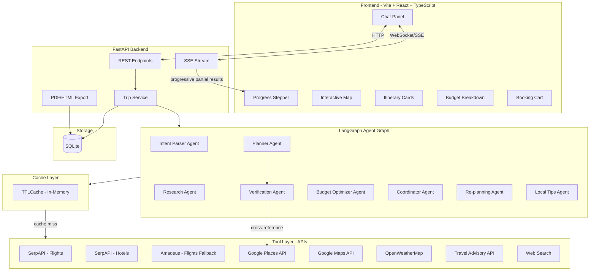
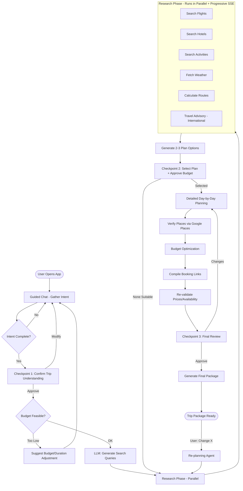

# AI Travel Planning & Booking Agent System

## Architecture Overview



## LangGraph Workflow (State Machine)



## Tech Stack

- **Frontend**: Vite + React 18 + TypeScript + Tailwind CSS + shadcn/ui
- **Backend**: FastAPI + Python 3.11+
- **Agents**: LangGraph + LangChain
- **LLM (Tiered)**:
  - `gpt-4o` — Intent parsing, re-planning, ambiguity resolution (complex reasoning)
  - `gpt-4o-mini` — Narration, trade-off explanations, local tips (high-volume, cheaper ~15x)
- **Database**: SQLite via SQLAlchemy
- **Caching**: In-memory TTLCache (`cachetools`) keyed by `(query_type, destination, dates)` with 1-hour TTL
- **Real-time**: Server-Sent Events (SSE) with progressive partial results
- **Maps**: Google Maps JavaScript API (display) + Directions API (routing)
- **PDF**: WeasyPrint (HTML-to-PDF)
- **Resilience**: Circuit breaker pattern (`tenacity` retries + exponential backoff) with API fallback chains
- **APIs**:
  - SerpAPI — Google Flights + Google Hotels (100 free searches/month)
  - Amadeus API — Flights fallback (free tier: 500 calls/month)
  - Google Places API — activities, restaurants, reviews, **verification** ($200/mo free credit)
  - Google Maps API — routing, distances ($200/mo free credit)
  - OpenWeatherMap — 5-day forecast (free tier: 1000 calls/day)
  - Currency: ExchangeRate API (free tier)
  - Travel Advisory: Sherpa/Visalist API — visa requirements, travel advisories (free tier)

## Project Structure

```
week2/
├── backend/
│   ├── app/
│   │   ├── main.py                  # FastAPI entry, CORS, lifespan
│   │   ├── config.py                # Pydantic Settings (API keys, LLM model config)
│   │   ├── models/
│   │   │   ├── trip.py              # TripRequest, TripResponse, PlanOption
│   │   │   ├── itinerary.py         # DayPlan, Activity, TimeSlot
│   │   │   ├── booking.py           # FlightOption, HotelOption, BookingItem
│   │   │   └── agent_state.py       # LangGraph TripState TypedDict
│   │   ├── agents/
│   │   │   ├── graph.py             # LangGraph StateGraph definition
│   │   │   ├── intent_parser.py     # Parse user preferences → structured
│   │   │   ├── researcher.py        # Query generation (LLM) + parallel tool orchestration
│   │   │   ├── planner.py           # Generate plan options + detailed itinerary
│   │   │   ├── verifier.py          # Cross-reference all places against Google Places
│   │   │   ├── optimizer.py         # Budget optimization + trade-off logic
│   │   │   ├── coordinator.py       # Compile bookings + final package
│   │   │   └── replanner.py         # Handle dynamic changes
│   │   ├── tools/
│   │   │   ├── flights.py           # SerpAPI Google Flights wrapper
│   │   │   ├── flights_amadeus.py   # Amadeus API fallback for flights
│   │   │   ├── hotels.py            # SerpAPI Hotels + Google Places
│   │   │   ├── activities.py        # Google Places for things to do
│   │   │   ├── weather.py           # OpenWeatherMap wrapper
│   │   │   ├── maps.py              # Google Maps Directions + Distance
│   │   │   ├── currency.py          # ExchangeRate API
│   │   │   ├── travel_advisory.py   # Visa requirements + travel advisories
│   │   │   ├── web_search.py        # SerpAPI general search (fallback)
│   │   │   └── resilience.py        # Circuit breaker decorator + retry logic
│   │   ├── services/
│   │   │   ├── trip_service.py      # Orchestrate trip creation + CRUD
│   │   │   ├── export_service.py    # PDF + HTML generation
│   │   │   ├── cache.py             # TTLCache wrapper keyed by (query_type, dest, dates)
│   │   │   └── sse_manager.py       # SSE event broadcasting
│   │   ├── db/
│   │   │   ├── database.py          # SQLite engine + session
│   │   │   ├── models.py            # SQLAlchemy ORM models
│   │   │   └── seed.py              # Pre-baked sample trips loader
│   │   └── api/
│   │       ├── trips.py             # /trips endpoints
│   │       ├── chat.py              # /chat SSE endpoint
│   │       └── export.py            # /export PDF/HTML endpoints
│   ├── requirements.txt
│   └── .env.example
├── frontend/
│   ├── src/
│   │   ├── App.tsx                  # Main layout + routing
│   │   ├── pages/
│   │   │   ├── HomePage.tsx         # Landing / new trip + sample trips gallery
│   │   │   └── TripPage.tsx         # Active trip planning view
│   │   ├── components/
│   │   │   ├── chat/
│   │   │   │   ├── ChatPanel.tsx    # Chat message list + input
│   │   │   │   ├── ChatMessage.tsx  # Individual message bubble
│   │   │   │   ├── ApprovalCard.tsx # Checkpoint approval cards
│   │   │   │   └── PlanOptionCard.tsx
│   │   │   ├── progress/
│   │   │   │   └── ProgressStepper.tsx  # Top progress bar
│   │   │   ├── itinerary/
│   │   │   │   ├── ItineraryTimeline.tsx
│   │   │   │   ├── DayCard.tsx
│   │   │   │   └── ActivityItem.tsx
│   │   │   ├── map/
│   │   │   │   └── TripMap.tsx      # Google Maps with routes
│   │   │   ├── budget/
│   │   │   │   └── BudgetBreakdown.tsx  # Chart + table
│   │   │   ├── booking/
│   │   │   │   └── BookingCart.tsx
│   │   │   └── common/
│   │   │       ├── Header.tsx
│   │   │       ├── LoadingStates.tsx
│   │   │       └── ErrorRecovery.tsx # Error states with retry/skip actions
│   │   ├── hooks/
│   │   │   ├── useSSE.ts            # SSE connection hook
│   │   │   └── useTrip.ts           # Trip state management + session recovery
│   │   ├── services/
│   │   │   └── api.ts               # Axios/fetch wrapper
│   │   ├── types/
│   │   │   └── index.ts             # Shared types matching backend
│   │   └── lib/
│   │       └── utils.ts
│   ├── package.json
│   ├── tailwind.config.ts
│   ├── tsconfig.json
│   └── vite.config.ts
├── .gitignore
├── .env.example
└── README.md
```

## UI Layout (Travel-Themed)

```
┌─────────────────────────────────────────────────────────┐
│  TripCraft               [New Trip]  [My Trips]         │
├─────────────────────────────────────────────────────────┤
│  ○ Understand ─── ● Research ─── ○ Plan ─── ○ Book     │  ← Progress Stepper
├──────────────────────┬──────────────────────────────────┤
│                      │                                  │
│   CHAT PANEL         │   LIVE PREVIEW PANEL             │
│                      │                                  │
│   Bot: Where would   │   ┌─ Interactive Map ──────────┐ │
│   you like to go?    │   │  (routes, pins, day colors) │ │
│                      │   └────────────────────────────┘ │
│   You: Tokyo, 5 days │                                  │
│                      │   ┌─ Budget Breakdown ─────────┐ │
│   Bot: Great! What's │   │  ████████░░ $12,500/15,000  │ │
│   your budget?       │   └────────────────────────────┘ │
│                      │                                  │
│   [Option A] [B] [C] │   ┌─ Day 1 ── Day 2 ── Day 3 ─┐ │
│   ← Approval Cards   │   │  Itinerary Timeline        │ │
│                      │   └────────────────────────────┘ │
│   ┌─────────────┐   │                                  │
│   │ Type here... │   │   [Download PDF] [Share HTML]    │
│   └─────────────┘   │                                  │
└──────────────────────┴──────────────────────────────────┘
```

- **Color palette**: Warm tones — sunset orange (#F97316), ocean teal (#0891B2), sand beige (#FEF3C7), forest green (#16A34A)
- **Typography**: Inter (body) + Playfair Display (headings) for a premium travel feel
- **Animations**: Framer Motion for card transitions, phase changes, map pin drops

## LLM vs Heuristics Strategy

**Principle**: Only invoke the LLM when reasoning, generation, or ambiguity resolution is required. Everything else uses deterministic heuristics, regex, lookups, or simple math.

### What does NOT need LLM

- **Date parsing**: Regex + `dateutil.parser` for "next weekend", "March 15-20", relative dates
- **Budget parsing**: Regex to extract numbers + currency symbols (₹15,000 / $2000 / 2000 USD)
- **Currency detection**: Lookup table mapping origin/destination country → currency code
- **Input validation**: Rule-based checks (budget > 0, dates in future, destination not empty)
- **Budget feasibility check**: Lookup table of `min_viable_cost(destination, days, style)` — early exit before research if budget is unrealistic
- **Guardrails / junk filtering**: Keyword blocklist + regex for greetings, off-topic, inappropriate
- **Budget optimization**: Greedy algorithm — sort items by cost, swap with cheaper alternatives until under budget; no LLM needed for math
- **Budget allocation**: Heuristic percentage splits by travel style (backpacking: 15% transport, 25% stay, 20% food, 25% activities, 15% buffer; luxury: different ratios)
- **Time slot scheduling**: Constraint solver — sort activities by location proximity (from Google Maps distances), respect opening hours, insert travel time gaps
- **Route optimization**: Nearest-neighbor heuristic on Google Maps distance matrix for day-wise activity ordering
- **Weather suitability**: Simple rules (rain > 60%? → suggest indoor activities; temp > 35C? → avoid midday outdoor)
- **API response normalization**: Pydantic model parsing, deterministic data transforms
- **Caching layer**: TTLCache keyed by `(query_type, destination, dates)` — pure key-value lookup, no LLM
- **Place verification**: Cross-reference place names against Google Places API — deterministic string matching + place_id validation
- **Price re-validation**: Re-fetch selected items at Checkpoint 3; diff comparison is pure math
- **Circuit breaker / retries**: `tenacity` decorator with exponential backoff — pure logic
- **SSE event emission**: Pure logic, no LLM
- **Export (PDF/HTML)**: Template rendering with Jinja2
- **Coordinator flow**: LangGraph conditional edges based on state flags, not LLM decisions
- **Session recovery**: Restore from persisted LangGraph state in SQLite — deterministic

### What NEEDS LLM

- **Intent understanding** (only for ambiguous/complex free-form input): "I want something chill but also exciting" → interpret travel style. Simple inputs like "Tokyo, 5 days, $2000" are parsed by heuristics first; LLM is fallback only. **Model: `gpt-4o`**
- **Guided conversation**: Generate natural follow-up questions when preferences are incomplete. **Model: `gpt-4o-mini`**
- **Research query generation**: One focused LLM call to translate parsed intent into 5-10 specific search queries (e.g., preferences "adventure + spiritual in Rishikesh" → ["white water rafting Rishikesh", "yoga ashram Rishikesh", "Ganga Aarti Rishikesh"]). **Model: `gpt-4o-mini`**
- **Plan option generation**: Synthesize research data into coherent plan narratives with trade-off explanations ("Option A is ₹200 cheaper but adds 2 hours of travel time"). **Model: `gpt-4o-mini`**
- **Day-by-day itinerary narrative**: Generate human-readable descriptions for each activity/day (after scheduling is done by heuristics). **Model: `gpt-4o-mini`**
- **Reasoning transparency**: Produce natural-language justifications ("Why this hotel? It's the closest 4-star to your Day 2 activities and ₹30/night under budget"). **Model: `gpt-4o-mini`**
- **Re-planning analysis**: Understand free-form change requests ("My flight got delayed 4 hours, adjust Day 1"). **Model: `gpt-4o`**
- **Local tips synthesis**: Summarize scraped Reddit/blog content into actionable tips. **Model: `gpt-4o-mini`**
- **Edge case handling**: When APIs return no results and alternatives search also fails, LLM decides what to suggest. **Model: `gpt-4o`**

## Agent Details

### Core Agents

**1. Intent Parser Agent**

- Input: Chat messages from guided conversation
- **Heuristic-first**: Regex + keyword extraction for destination, dates, budget, traveler count
- **LLM fallback**: Only invoked when heuristic parsing fails or input is ambiguous
- LLM generates follow-up questions when required fields are missing
- Output: Structured `TripRequest`
- Currency detection via country→currency lookup table (no LLM)

**2. Research Agent**

- **Step 1 — Query Generation (LLM)**: One focused `gpt-4o-mini` call to translate structured `TripRequest` into 5-10 specific search queries per category (flights, hotels, activities). E.g., `{style: "adventure + spiritual", dest: "Rishikesh"}` → `["white water rafting Rishikesh", "yoga ashram Rishikesh", "Ganga Aarti timings"]`
- **Step 2 — Parallel Execution (No LLM)**: Runs all tool calls in parallel: flights, hotels, activities, weather, routes, travel advisory
- **Caching**: All API calls go through TTLCache — cache hit skips the API entirely
- **Fallback chains**: SerpAPI flights → Amadeus flights → cached results. SerpAPI hotels → Google Places hotels → cached. Circuit breaker via `tenacity` with exponential backoff (3 retries)
- **Progressive SSE**: Emits results per sub-task as they complete: `research_flights_done`, `research_hotels_done`, etc. Frontend renders partial results immediately
- **No LLM** in step 2 — it's a tool orchestration layer
- **For international trips**: Also fetches visa requirements from Travel Advisory API and surfaces at Checkpoint 1

**3. Planner Agent**

- Input: Research results + user preferences
- **Heuristic scheduling**: Time slot allocation via constraint solver, route optimization via nearest-neighbor on distance matrix, opening hours enforcement
- **Heuristic budget split**: Percentage-based allocation by travel style
- **Anti-hallucination rule**: LLM prompt includes strict constraint — "Only reference places, prices, and URLs from the provided research data. Do not invent any location, price, or booking link." All activities in structured output must reference a `research_result_id`
- **LLM used for** (`gpt-4o-mini`): Generating 2-3 plan option narratives with trade-off explanations, and day-by-day activity descriptions after heuristic scheduling
- All itinerary times shown in destination local time with UTC offset for international trips

**4. Budget Optimizer Agent**

- Input: Detailed itinerary + budget constraint
- **Pure heuristics**: Greedy cost reduction — sort items by savings potential, swap with cheaper alternatives, reallocate buffer
- **No LLM** — this is a math/optimization problem
- Outputs structured reasoning log: "Switched from 4-star to 3-star hotel (saves $40/night)"

**5. Coordinator Agent** (LangGraph orchestration logic in `graph.py`)

- **Pure logic**: Manages state machine flow via LangGraph conditional edges
- Handles checkpoint pauses (waits for human input)
- **Budget feasibility gate**: Before research phase, checks `min_viable_cost(destination, days, style)` from lookup table. If budget < minimum, surfaces warning at Checkpoint 1 with suggestion to adjust budget or duration
- **Price re-validation**: Before Checkpoint 3, re-fetches prices for selected flight + hotel + top activities. If prices changed, shows diff to user ("Hotel price increased ₹200/night since last review")
- Compiles final booking cart with links, maps, contact info
- Triggers PDF/HTML export
- **No LLM** — deterministic orchestration

**6. Verification Agent** (runs between Planner and Checkpoint 3)

- **Pure heuristics**: For each hotel, restaurant, and activity in the itinerary, cross-reference `place_name + destination` against Google Places API
- If Google Places returns a matching `place_id` → verified ✓
- If no match → flagged as "unverified" in UI, or replaced with closest verified alternative from research data
- Also validates booking URLs via HTTP HEAD check — dead links are auto-replaced or flagged
- **No LLM** — deterministic API lookups + string matching

### Stretch Agents

**7. Re-planning Agent** — **LLM used** (`gpt-4o`) to interpret free-form change requests; then heuristic-based delta computation to determine which days/components need re-research

**8. Local Tips Agent** — Web search (SerpAPI) + **LLM used** (`gpt-4o-mini`) to summarize and filter scraped content into actionable tips

## API Endpoints

```
POST   /api/trips                    # Create new trip (starts LangGraph)
GET    /api/trips/{id}               # Get trip state
GET    /api/trips/{id}/stream        # SSE stream for live updates
POST   /api/trips/{id}/chat          # Send user message / approval
POST   /api/trips/{id}/checkpoint    # Submit checkpoint decision
POST   /api/trips/{id}/replan        # Trigger re-planning
GET    /api/trips/{id}/export/pdf    # Download PDF
GET    /api/trips/{id}/export/html   # Download HTML
```

## SSE Event Types

```
phase_update       → { phase, step, detail }        # "Researching → Searching flights from NYC..."
agent_thinking     → { agent, thought }              # Reasoning transparency
research_partial   → { source, data }                # Progressive: flights done → render immediately
api_degraded       → { source, fallback_used }       # "SerpAPI down, using Amadeus fallback"
price_changed      → { item, old_price, new_price }  # Re-validation diff at Checkpoint 3
checkpoint         → { type, options, data }          # Human approval needed
plan_ready         → { options: PlanOption[] }        # Plan options to display
itinerary_ready    → { itinerary: DayByDay }          # Full itinerary to render
map_update         → { markers, routes }              # Map data
budget_update      → { breakdown: Budget }            # Budget chart data
error              → { message, recovery_options }    # Graceful error with retry/skip actions
complete           → { trip_package: FinalPackage }   # Done
```

## Database Schema (SQLite)

```sql
trips (
    id TEXT PRIMARY KEY,
    created_at TIMESTAMP,
    updated_at TIMESTAMP,
    status TEXT,            -- 'planning', 'researching', 'ready', 'replanning'
    last_checkpoint TEXT,   -- 'cp1', 'cp2', 'cp3', NULL — for session recovery
    is_sample BOOLEAN,      -- TRUE for pre-baked sample trips
    request_json TEXT,      -- Serialized TripRequest
    state_json TEXT,        -- Full LangGraph state snapshot (via SqliteSaver)
    research_json TEXT,     -- Cached research results for re-validation
    itinerary_json TEXT,    -- Final itinerary
    budget_json TEXT        -- Budget breakdown
)
```

## Key Design Decisions Summary

- **Vite + React** over Next.js: No SSR needed, faster setup, lighter — FastAPI handles all backend concerns
- **SSE over WebSockets**: Simpler for one-directional server→client streaming; HTTP POST for client→server
- **Progressive SSE rendering**: Stream each research sub-result as it completes — frontend renders partial data immediately, reducing perceived latency from ~20s to feeling instant
- **SQLite**: Zero-config persistence, good enough for demo + single-server production
- **LangGraph SqliteSaver**: Native checkpointing for session recovery — user can close browser and resume from last checkpoint
- **Tiered agents**: 6 core agents (including Verification) ship solid, stretch agents add value without risking the core
- **Tiered LLM models**: `gpt-4o` for complex reasoning (intent, re-planning), `gpt-4o-mini` for narration (~15x cheaper, ~60-70% cost reduction vs all-GPT-4o)
- **Guided chat**: More controlled than free-form, ensures we capture all needed preferences
- **Google Maps API**: $200 free credit covers all demo needs; best routing data quality
- **Heuristics-first**: LLM only for narrative generation, query generation, ambiguity resolution, and conversation — all parsing, optimization, scheduling, verification, and orchestration use deterministic logic
- **Caching + API diversification**: TTLCache (1hr TTL) + Amadeus fallback spreads load across free tiers, supporting ~50-100 trips/month instead of ~10-20
- **Anti-hallucination**: Planner constrained to research data only; Verification Agent cross-references all places against Google Places before user sees them
- **Pre-baked sample trips**: 3 sample trips stored in DB for reliable demos, loadable from homepage

## Edge Case Handling

| Edge Case | Detection | Response |
|-----------|-----------|----------|
| **Unrealistic budget** | `min_viable_cost(dest, days, style)` lookup at Checkpoint 1 | Surface warning: "Budget of ₹2,000 too low for 4-day Rishikesh trip. Min: ~₹8,000. Adjust budget or duration?" |
| **No direct transport** | Flights API returns 0 results for origin→destination | Auto-search nearest hub city (airport lookup table), suggest multi-leg: "No direct flights to Rishikesh. Fly to Dehradun + 1hr taxi" |
| **Session dropout** | `last_checkpoint` field in DB + LangGraph SqliteSaver | On page load, `GET /api/trips/{id}` returns persisted state; frontend restores UI to last checkpoint |
| **API outage** | Circuit breaker trips after 3 failed retries | Fallback chain: primary → alternative API → cached results → LLM suggestion (flagged "unverified"). SSE emits `api_degraded` event |
| **International travel** | Destination country ≠ origin country | Fetch visa requirements from Travel Advisory API; surface at Checkpoint 1: "Visa required for Japan from India. Processing: ~5 business days" |
| **Stale prices** | Time gap between Checkpoint 2 and 3 | Re-fetch prices for selected items before Checkpoint 3; show diff if changed via `price_changed` SSE event |
| **Hallucinated places** | Verification Agent finds no Google Places match | Replace with closest verified alternative from research data, or flag as "unverified" in UI |
| **Dead booking links** | HTTP HEAD check returns non-200 | Auto-replace with search URL fallback (e.g., `google.com/travel/hotels?q=...`) or flag for user |

## Resilience Strategy

```
API Fallback Chains:
  Flights:    SerpAPI → Amadeus → Cached Results → LLM suggestion (flagged)
  Hotels:     SerpAPI → Google Places → Cached Results → LLM suggestion (flagged)
  Activities: Google Places → Web Search → Cached Results → LLM suggestion (flagged)
  Weather:    OpenWeatherMap → Cached Results → "Weather data unavailable" notice

Retry Policy (tenacity):
  - Max 3 retries per API call
  - Exponential backoff: 1s, 2s, 4s
  - Circuit breaker: after 5 consecutive failures for a source, skip it for 5 minutes

Graceful Degradation:
  - If flights unavailable: show alternative transport (bus/train search)
  - If hotels unavailable: show "accommodation search" with booking site links
  - If all APIs down: generate trip skeleton from LLM with clear "unverified" flags throughout
```

## Sample Trips Deliverable

Three pre-computed trips stored via `db/seed.py`, loaded on first app startup:

| # | Style | Input | Destination | Budget |
|---|-------|-------|-------------|--------|
| 1 | Solo Backpacking | "4-day adventure + spiritual trip from Delhi" | Rishikesh | ₹15,000 |
| 2 | Family Vacation | "5-day family trip with 2 kids, comfort priority" | Goa | ₹60,000 |
| 3 | Weekend Getaway | "2-day quick escape from Bangalore" | Coorg | ₹8,000 |

- Stored with full itinerary, budget breakdown, map data, and booking links
- Accessible from `HomePage.tsx` as "Example Trips" cards
- Serve as reliable demo fallback even if live APIs are down

## UI Error Recovery Flows

When an `error` SSE event fires, `ErrorRecovery.tsx` renders contextual recovery actions:

| Error Type | UI Display | Actions |
|------------|------------|---------|
| API search failed | "Couldn't find flights from Delhi" | [Retry] [Skip flights, show alternatives] [Change origin] |
| No results found | "No hotels match your budget in Rishikesh" | [Increase budget] [Try nearby area] [Show all price ranges] |
| Price changed | "Hotel price increased ₹200/night" | [Accept new price] [Find cheaper alternative] [Keep old plan] |
| Session expired | "Your session was interrupted" | [Resume from Checkpoint X] [Start over] |
| All APIs down | "Travel data services temporarily unavailable" | [Retry all] [Use cached/sample data] [Try again later] |
